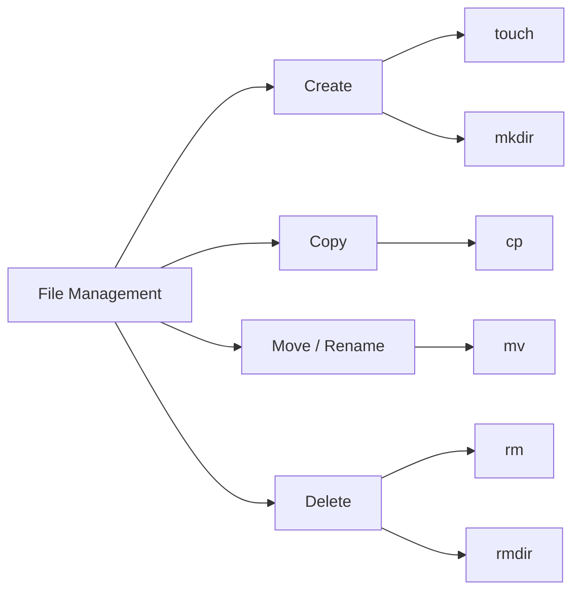

# 📁 File Management

> Creating, copying, moving, renaming, and deleting files and directories in Linux.

---

## On This Page

- [Quick Cheat Sheet](#quick-cheat-sheet)
- [Overview](#overview)
- [Core Commands](#core-commands)
- [File vs Directory Operations](#file-vs-directory-operations)
- [Safety Tips](#safety-tips)
- [Files in This Folder](#files-in-this-folder)

---

## Quick Cheat Sheet

| Command | Purpose |
|---|---|
| `touch FILE` | Create empty file |
| `mkdir DIR` | Create directory |
| `cp SRC DEST` | Copy file |
| `cp -r SRC DEST` | Copy directory |
| `mv SRC DEST` | Move or rename |
| `rm FILE` | Delete file |
| `rm -r DIR` | Delete directory recursively |
| `rmdir DIR` | Remove empty directory |

---

## Overview

Linux file management revolves around a small set of commands:

```text
Create
  ↓
Copy
  ↓
Move / Rename
  ↓
Delete
```

These operations apply to both files and directories.

---

## Core Commands



---

## File vs Directory Operations

Create file:

```bash
touch notes.txt
```

Create directory:

```bash
mkdir project
```

Copy file:

```bash
cp notes.txt backup.txt
```

Copy directory:

```bash
cp -r project project-backup
```

Move or rename:

```bash
mv notes.txt notes-old.txt
```

Delete file:

```bash
rm notes.txt
```

Delete directory:

```bash
rm -r project
```

---

## Safety Tips

Before destructive commands, verify where you are:

```bash
pwd
ls
```

Be especially careful with:

```bash
rm -r
rm -rf
```

There is normally no recycle bin when deleting from the CLI.

Interactive deletion can help:

```bash
rm -i file.txt
```

---

## Files in This Folder

```text
02-File-Management/
├── README.md
├── cp.md
├── mv.md
├── rm.md
├── mkdir.md
├── rmdir.md
└── touch.md
```

---

## Key Mental Model

```text
touch / mkdir
      ↓
     cp
      ↓
     mv
      ↓
 rm / rmdir
```

---

## Related Topics

- `../01-Navigation/`
- `../../../02-File-System/`
- `../../../03-Users-Groups-Permissions/`

---

## Conclusion

For everyday file management, master:

```bash
touch
mkdir
cp
mv
rm
```

These commands form the foundation of almost every Linux administration workflow.