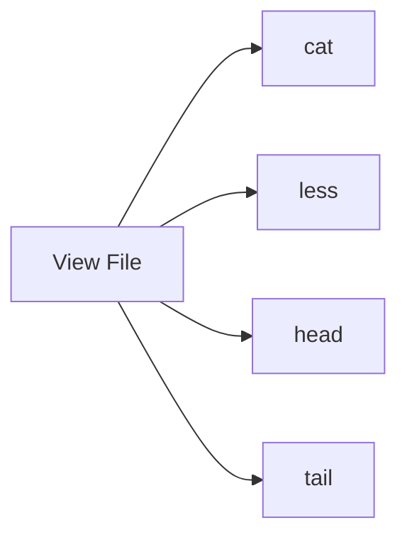

# 👀 Viewing & Editing Files

> Reading, inspecting, and editing text files from the Linux command line.

---

## On This Page

- [Quick Cheat Sheet](#quick-cheat-sheet)
- [Overview](#overview)
- [Viewing Commands](#viewing-commands)
- [Editing Commands](#editing-commands)
- [Practical Workflow](#practical-workflow)
- [Files in This Folder](#files-in-this-folder)

---

## Quick Cheat Sheet

| Command | Purpose |
|---|---|
| `cat FILE` | Print entire file |
| `less FILE` | Browse long file |
| `head FILE` | Show first lines |
| `tail FILE` | Show last lines |
| `tail -f FILE` | Follow file live |
| `nano FILE` | Simple terminal editor |
| `vi FILE` | Powerful terminal editor |

---

## Overview

Linux administrators constantly work with text files such as:

```text
Configuration files
Log files
Scripts
Service files
Application settings
```

The main question is usually:

```text
Do I want to read the file
or
modify the file?
```

---

## Viewing Commands



Use:

```bash
cat file.txt
```

for short files.

Use:

```bash
less file.txt
```

for large files.

Show the beginning:

```bash
head file.txt
```

Show the end:

```bash
tail file.txt
```

Follow a growing log:

```bash
tail -f /var/log/messages
```

---

## Editing Commands

Simple editor:

```bash
nano file.txt
```

Powerful modal editor:

```bash
vi file.txt
```

For quick Linux administration, knowing at least one terminal editor is essential.

---

## Practical Workflow

A common pattern:

```text
Locate file
    ↓
Inspect file
    ↓
Back it up
    ↓
Edit
    ↓
Verify changes
```

Example:

```bash
cp app.conf app.conf.bak
less app.conf
nano app.conf
cat app.conf
```

---

## Files in This Folder

```text
03-Viewing-Editing/
├── README.md
├── cat.md
├── less.md
├── head-tail.md
├── nano.md
└── vi.md
```

---

## Choosing the Right Tool

```text
Small file       → cat
Large file       → less
Beginning only   → head
End / live log   → tail
Simple editing   → nano
Advanced editing → vi
```

---

## Related Topics

- `../02-File-Management/`
- `../04-Searching/`
- `../../../09-Logs-Monitoring/`

---

## Conclusion

For everyday Linux work, these commands cover most file inspection and editing tasks:

```bash
cat
less
head
tail
nano
vi
```

The next step is learning when each one is the best tool for the job.