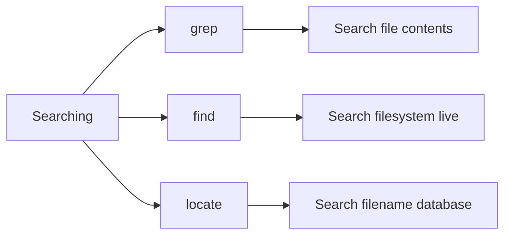

# 🔎 Searching

> Finding text, files, and directories efficiently from the Linux command line.

---

## On This Page

- [Quick Cheat Sheet](#quick-cheat-sheet)
- [Overview](#overview)
- [Three Search Tools](#three-search-tools)
- [Typical Workflow](#typical-workflow)
- [Files in This Folder](#files-in-this-folder)
- [Why This Matters](#why-this-matters)

---

## Quick Cheat Sheet

| Command | Purpose |
|---|---|
| `grep TEXT FILE` | Search inside file contents |
| `grep -R TEXT DIR` | Search recursively |
| `grep -i TEXT FILE` | Case-insensitive search |
| `find PATH -name NAME` | Find by filename |
| `find PATH -type f` | Find files |
| `find PATH -type d` | Find directories |
| `locate NAME` | Fast filename/path search |
| `updatedb` | Refresh locate database |

---

## Overview

Linux searching usually means one of two things:

```text
Search inside file contents
        ↓
grep

Search for files/directories
        ↓
find / locate
```

Choosing the right tool makes searches much faster and clearer.

---

## Three Search Tools



---

## grep

Use `grep` when you know the file or directory but want to find text inside it.

Example:

```bash
grep "error" app.log
```

Recursive search:

```bash
grep -R "listen" /etc/nginx/
```

---

## find

Use `find` when you want to locate files or directories based on properties.

Example:

```bash
find /var/log -name "*.log"
```

Find files larger than 1 GB:

```bash
find /var -type f -size +1G
```

---

## locate

`locate` searches a prebuilt filename database.

Example:

```bash
locate sshd_config
```

It is usually much faster than `find`, but results may be outdated until the database is refreshed.

```bash
sudo updatedb
```

---

## Typical Workflow

Suppose you need to find where a setting appears.

First locate candidate files:

```bash
find /etc -type f -name "*.conf"
```

Then search their contents:

```bash
grep -R "PermitRootLogin" /etc/ssh/
```

Mental model:

```text
Where is the file?
      ↓
find / locate
      ↓
What is inside?
      ↓
grep
```

---

## Files in This Folder

```text
04-Searching/
├── README.md
├── grep.md
├── find.md
└── locate.md
```

---

## Why This Matters

Searching is essential for:

```text
Troubleshooting
Configuration
Logs
Security checks
Shell scripting
Automation
Kubernetes/Linux administration
```

Examples:

```bash
grep -i "failed" /var/log/secure
find /etc -name "*.conf"
locate nginx.conf
```

---

## Related Topics

- `../03-Viewing-Editing/`
- `../05-Text-Processing/`
- `../../../09-Logs-Monitoring/`
- `../../../13-Troubleshooting/`

---

## Conclusion

Use:

```text
grep   → search inside text
find   → search filesystem live
locate → search paths quickly
```

The key skill is not memorizing options.

It is knowing which search tool matches the question you are asking.