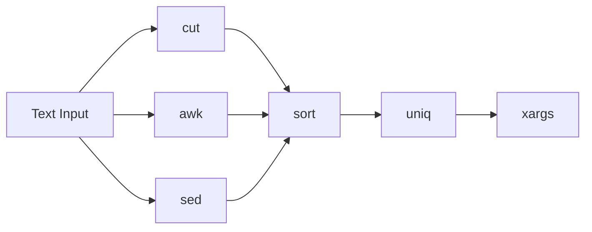

# 🧪 Text Processing

> Transforming, filtering, extracting, sorting, and combining text from the Linux command line.

---

## On This Page

- [Quick Cheat Sheet](#quick-cheat-sheet)
- [Overview](#overview)
- [Core Commands](#core-commands)
- [Typical Workflow](#typical-workflow)
- [Files in This Folder](#files-in-this-folder)
- [Why This Matters](#why-this-matters)

---

## Quick Cheat Sheet

| Command | Purpose |
|---|---|
| `sort` | Sort lines |
| `uniq` | Remove/count adjacent duplicates |
| `cut` | Extract columns or fields |
| `awk` | Process structured text |
| `sed` | Search and transform text |
| `xargs` | Convert input into command arguments |

---

## Overview

Linux tools often produce text.

Text-processing commands let you turn that output into useful information.

Example:

```bash
ps aux | awk '{print $1}' | sort | uniq
```

This combines several small commands into one workflow.

A useful mental model is:

```text
Raw Text
   ↓
Filter
   ↓
Extract
   ↓
Transform
   ↓
Sort
   ↓
Use Result
```

---

## Core Commands



Each command has a different strength:

```text
sort  → ordering
uniq  → duplicate handling
cut   → simple field extraction
awk   → structured text processing
sed   → text replacement/transformation
xargs → pass text into commands
```

---

## Typical Workflow

Suppose a file contains:

```text
alice,developer
bob,admin
alice,developer
```

Extract usernames:

```bash
cut -d',' -f1 users.csv
```

Sort them:

```bash
cut -d',' -f1 users.csv | sort
```

Remove duplicates:

```bash
cut -d',' -f1 users.csv | sort | uniq
```

---

## Files in This Folder

```text
05-Text-Processing/
├── README.md
├── sort-uniq.md
├── cut.md
├── awk.md
├── sed.md
└── xargs.md
```

---

## Why This Matters

Text processing appears constantly in:

```text
Log analysis
Shell scripting
Configuration
Monitoring
CI/CD
Containers
Kubernetes
Troubleshooting
```

Linux administration becomes much more powerful once commands are chained together with pipes.

---

## Related Topics

- `../03-Viewing-Editing/`
- `../04-Searching/`
- `../08-Shell-Utilities/`
- `../../../08-Shell-Scripting/`

---

## Conclusion

The goal is not to memorize every option.

The goal is to become comfortable with this pattern:

```text
command
   |
filter
   |
transform
   |
result
```

That is one of the core ideas behind the Unix command-line philosophy.