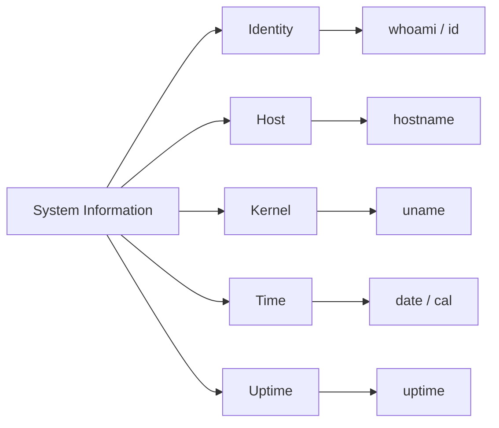

# 🖥️ System Information

> Quickly identifying the Linux system, current user, hostname, kernel, date, and uptime.

---

## On This Page

- [Quick Cheat Sheet](#quick-cheat-sheet)
- [Overview](#overview)
- [Core Commands](#core-commands)
- [Typical Workflow](#typical-workflow)
- [Files in This Folder](#files-in-this-folder)
- [Why This Matters](#why-this-matters)

---

## Quick Cheat Sheet

| Command | Purpose |
|---|---|
| `date` | Show current date and time |
| `cal` | Display calendar |
| `hostname` | Show system hostname |
| `uname` | Show kernel/system information |
| `whoami` | Show current username |
| `id` | Show UID, GID, and groups |
| `uptime` | Show uptime and load average |

---

## Overview

System-information commands answer basic questions such as:

```text
Who am I?
What machine am I on?
What kernel is running?
How long has the system been up?
What time does the system think it is?
```

These checks are often the first step when connecting to an unfamiliar server.

---

## Core Commands



---

## Typical Workflow

When logging into a server:

```bash
whoami
hostname
uname -r
date
uptime
```

This quickly tells you:

```text
User
Server
Kernel
Time
System state
```

---

## Files in This Folder

```text
06-System-Information/
├── README.md
├── date-cal.md
├── hostname-uname.md
├── whoami-id.md
└── uptime.md
```

---

## Why This Matters

These commands are useful for:

```text
SSH sessions
Troubleshooting
Automation
Shell scripting
Inventory checks
Incident response
CI/CD jobs
```

Example:

```bash
echo "Host: $(hostname)"
echo "User: $(whoami)"
echo "Kernel: $(uname -r)"
echo "Time: $(date)"
```

---

## Key Mental Model

```text
Identity
   +
Host
   +
Kernel
   +
Time
   +
Uptime
   =
Basic system context
```

---

## Related Topics

- `../01-Navigation/`
- `../07-Environment/`
- `../../../05-Processes-Systemd/`
- `../../../09-Logs-Monitoring/`

---

## Conclusion

A useful five-command server check is:

```bash
whoami
hostname
uname -r
date
uptime
```

Before changing anything on a Linux host, first understand which system you are actually working on.