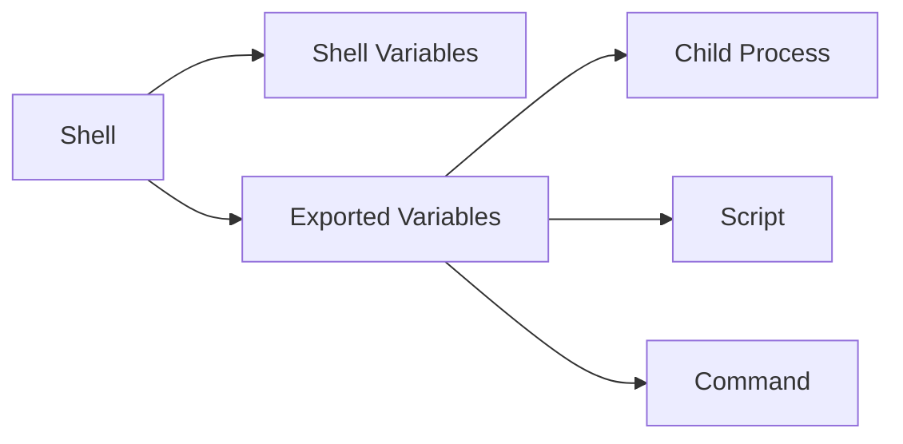

# 🌱 Shell Environment

> Understanding environment variables, exported values, PATH, and shell startup configuration.

---

## On This Page

- [Quick Cheat Sheet](#quick-cheat-sheet)
- [Overview](#overview)
- [Core Concepts](#core-concepts)
- [How Environment Inheritance Works](#how-environment-inheritance-works)
- [Files in This Folder](#files-in-this-folder)
- [Why This Matters](#why-this-matters)

---

## Quick Cheat Sheet

| Command / Variable | Purpose |
|---|---|
| `env` | Show environment |
| `printenv` | Print environment variables |
| `echo "$HOME"` | Show variable value |
| `export VAR=value` | Export variable |
| `unset VAR` | Remove variable |
| `echo "$PATH"` | Show command search path |
| `source FILE` | Load file into current shell |
| `~/.bashrc` | Common interactive Bash config |

---

## Overview

Every shell session has a set of variables that describe its environment.

Examples:

```text
HOME
USER
SHELL
PWD
PATH
LANG
```

Check one:

```bash
echo "$HOME"
```

Check many:

```bash
env
```

---

## Core Concepts

A shell variable:

```bash
NAME="alice"
```

exists in the current shell.

An exported variable:

```bash
export NAME="alice"
```

is also inherited by child processes.

This distinction is extremely important.

---

## How Environment Inheritance Works



Mental model:

```text
Shell starts
    ↓
Startup files load
    ↓
Variables are created
    ↓
Some are exported
    ↓
Child processes inherit them
```

---

## Files in This Folder

```text
07-Environment/
├── README.md
├── environment-variables.md
├── env-printenv.md
├── export.md
├── path.md
├── source.md
└── shell-startup-files.md
```

---

## Why This Matters

Environment variables affect:

```text
Command execution
Application configuration
Shell behavior
Scripts
CI/CD pipelines
Containers
Development tools
```

For example, when Linux says:

```text
command not found
```

the problem may simply be:

```text
PATH
```

---

## Practical Example

Create a variable:

```bash
APP_ENV="development"
```

Check it:

```bash
echo "$APP_ENV"
```

Export it:

```bash
export APP_ENV
```

Now child processes can access it:

```bash
bash -c 'echo "$APP_ENV"'
```

---

## Related Topics

- `../08-Shell-Utilities/`
- `../../../08-Shell-Scripting/`
- `../../../03-Users-Groups-Permissions/`

---

## Conclusion

The key distinction is:

```text
Shell variable
     ↓ export
Environment variable
     ↓
Inherited by child processes
```

Understanding this makes Bash, scripting, PATH problems, and application configuration much easier to reason about.