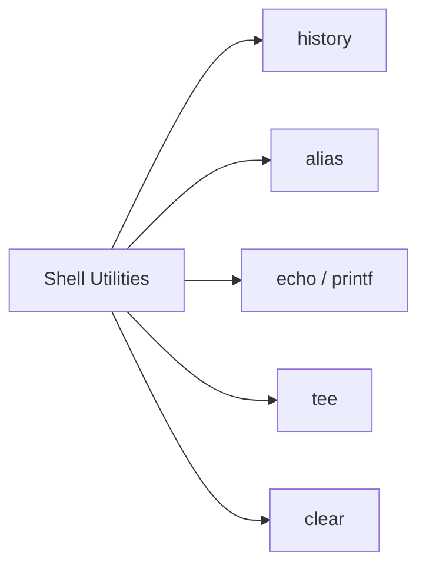

# 🧰 Shell Utilities

> Small but powerful commands that make everyday terminal work faster and more convenient.

---

## On This Page

- [Quick Cheat Sheet](#quick-cheat-sheet)
- [Overview](#overview)
- [Core Utilities](#core-utilities)
- [Typical Workflow](#typical-workflow)
- [Files in This Folder](#files-in-this-folder)
- [Why This Matters](#why-this-matters)

---

## Quick Cheat Sheet

| Command | Purpose |
|---|---|
| `history` | Show command history |
| `alias` | Create command shortcut |
| `unalias` | Remove alias |
| `echo` | Print text or variables |
| `printf` | Formatted output |
| `tee` | Display output and write to file |
| `clear` | Clear terminal screen |

---

## Overview

Shell utilities are small commands that improve day-to-day terminal work.

They help with:

```text
Command recall
Shortcuts
Output formatting
Saving command output
Terminal cleanup
```

These commands are simple, but they are used constantly in Linux administration and scripting.

---

## Core Utilities



Each tool has a different purpose:

```text
history       → recall previous commands
alias         → create shortcuts
echo / printf → print output
tee           → show and save output
clear         → clean terminal view
```

---

## Typical Workflow

Example:

```bash
history
```

Find a command you used earlier.

Create a shortcut:

```bash
alias ll='ls -lah'
```

Display information:

```bash
echo "System check complete"
```

Save output while still seeing it:

```bash
df -h | tee disk-report.txt
```

Clear the screen:

```bash
clear
```

---

## Files in This Folder

```text
08-Shell-Utilities/
├── README.md
├── history.md
├── alias-unalias.md
├── echo-printf.md
├── tee.md
└── clear.md
```

---

## Why This Matters

These utilities appear frequently in:

```text
Linux administration
Shell scripting
Troubleshooting
CI/CD
Automation
Configuration
```

`tee` is especially useful when output must both:

```text
appear on screen
+
be saved to a file
```

---

## Related Topics

- `../07-Environment/`
- `../05-Text-Processing/`
- `../../../08-Shell-Scripting/`

---

## Conclusion

Shell utilities make terminal work faster and more efficient.

The most useful commands in this section are:

```bash
history
alias
echo
printf
tee
clear
```

They are small tools, but they become part of everyday Linux muscle memory.