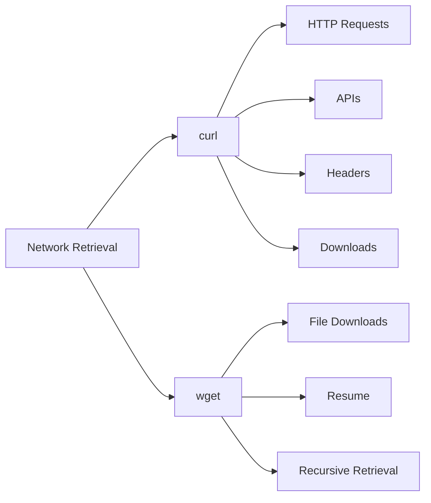

# 🌐 Download Tools

> Downloading files, testing HTTP endpoints, and retrieving web content from the Linux command line.

---

## On This Page

- [Quick Cheat Sheet](#quick-cheat-sheet)
- [Overview](#overview)
- [curl vs wget](#curl-vs-wget)
- [Common Tasks](#common-tasks)
- [Files in This Folder](#files-in-this-folder)
- [Why This Matters](#why-this-matters)

---

## Quick Cheat Sheet

| Command | Purpose |
|---|---|
| `curl URL` | Fetch content |
| `curl -I URL` | Show HTTP headers |
| `curl -O URL` | Download using remote filename |
| `curl -L URL` | Follow redirects |
| `wget URL` | Download file |
| `wget -c URL` | Resume download |
| `wget -O FILE URL` | Save with custom filename |
| `wget -r URL` | Recursive download |

---

## Overview

Linux provides several command-line tools for retrieving data over networks.

The two most common are:

```text
curl
wget
```

Both can download files, but their strengths are slightly different.

---

## curl vs wget



A useful mental model:

```text
curl
→ communicate with services

wget
→ retrieve files
```

This is not a strict rule, but it is a good starting point.

---

## Common Tasks

Check a web page:

```bash
curl https://example.com
```

Inspect headers:

```bash
curl -I https://example.com
```

Download a file:

```bash
curl -O https://example.com/file.tar.gz
```

Using `wget`:

```bash
wget https://example.com/file.tar.gz
```

Resume a partial download:

```bash
wget -c https://example.com/file.tar.gz
```

---

## Files in This Folder

```text
09-Download-Tools/
├── README.md
├── curl.md
├── wget.md
└── curl-vs-wget.md
```

---

## Why This Matters

These tools appear constantly in:

```text
Linux administration
API testing
CI/CD pipelines
Container builds
Kubernetes troubleshooting
Automation scripts
Software installation
Health checks
```

Example:

```bash
curl -fsS http://localhost:8080/health
```

This can quickly test whether an application endpoint is responding.

---

## Safety Note

Avoid piping downloaded content directly into a shell unless you trust and understand the source.

Risky pattern:

```bash
curl URL | bash
```

Safer approach:

```bash
curl -O URL
less downloaded-script.sh
bash downloaded-script.sh
```

Inspect first, execute second.

---

## Related Topics

- `../05-Text-Processing/`
- `../08-Shell-Utilities/`
- `../../../06-Networking/`
- `../../../08-Shell-Scripting/`

---

## Conclusion

The two core tools are:

```bash
curl
wget
```

Use `curl` heavily for HTTP requests and APIs.

Use `wget` when the task is primarily downloading files.