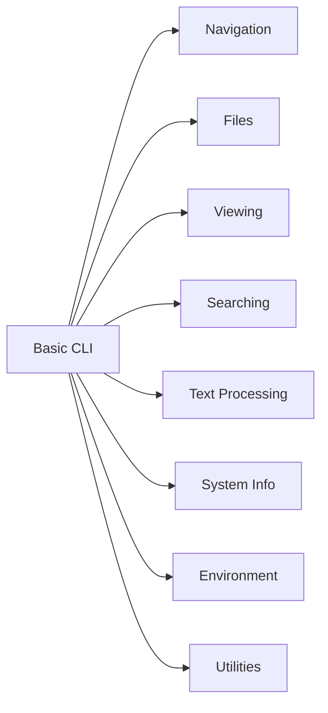

# 💻 Linux Basic CLI

> Essential Linux commands for navigating, inspecting, manipulating, and working efficiently from the terminal.

---

## On This Page

- [Quick Cheat Sheet](#quick-cheat-sheet)
- [Overview](#overview)
- [Command Groups](#command-groups)
- [Repository Structure](#repository-structure)
- [Learning Path](#learning-path)

---

## Quick Cheat Sheet

| Task | Commands |
|---|---|
| Navigation | `pwd`, `ls`, `cd` |
| Files | `cp`, `mv`, `rm`, `touch` |
| Directories | `mkdir`, `rmdir` |
| View files | `cat`, `less`, `head`, `tail` |
| Search | `grep`, `find`, `locate` |
| Text processing | `sort`, `uniq`, `cut`, `awk`, `sed` |
| System info | `hostname`, `uname`, `id`, `uptime` |
| Environment | `env`, `printenv`, `export` |
| Shell tools | `history`, `alias`, `echo` |
| Downloads | `curl`, `wget` |

---

## Overview

The Linux command line is the foundation of system administration and DevOps.

A useful mental model is:

```text
Navigate
   ↓
Inspect
   ↓
Search
   ↓
Modify
   ↓
Automate
```

Most advanced Linux tools are built on top of these basic command-line skills.

---

## Command Groups



---

## Repository Structure

```text
01-Basic-CLI/
├── README.md
├── 01-Navigation/
├── 02-File-Management/
├── 03-Viewing-Editing/
├── 04-Searching/
├── 05-Text-Processing/
├── 06-System-Information/
├── 07-Environment/
├── 08-Shell-Utilities/
├── 09-Download-Tools/
└── 10-Practical-Cheatsheet/
```

---

## Learning Path

Recommended order:

```text
Navigation
    ↓
File Management
    ↓
Viewing & Editing
    ↓
Searching
    ↓
Text Processing
    ↓
System Information
    ↓
Environment
    ↓
Shell Utilities
    ↓
Download Tools
```

---

## Why This Matters

These commands appear constantly in:

```text
Linux administration
Shell scripting
CI/CD pipelines
Containers
Kubernetes
Troubleshooting
Automation
```

Mastering them makes every later Linux topic easier.

---

## Conclusion

The goal of this folder is not memorization.

The goal is to become comfortable enough with the terminal that common tasks become automatic.

Start with:

```bash
pwd
ls
cd
```

and build from there.