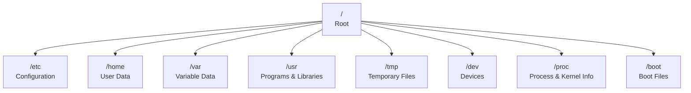

# 📁 Linux File System

> Understanding how Linux organizes files, directories, paths, links, and filesystem objects.

---

## On This Page

- [Quick Cheat Sheet](#quick-cheat-sheet)
- [Overview](#overview)
- [Filesystem Hierarchy](#filesystem-hierarchy)
- [Paths](#paths)
- [File Types](#file-types)
- [Links](#links)
- [Topics](#topics)

---

## Quick Cheat Sheet

| Command | Purpose |
|---|---|
| `pwd` | Show current directory |
| `ls -la` | Show files, including hidden files |
| `file NAME` | Identify file type |
| `stat NAME` | Show file metadata |
| `realpath NAME` | Show absolute path |
| `readlink NAME` | Inspect symbolic link |
| `find PATH` | Search for files |
| `df -h` | Show mounted filesystem usage |

---

## Overview

Linux organizes files into a single directory tree beginning at:

```text
/
```

Everything exists somewhere below the root directory:

```text
/
├── etc
├── home
├── usr
├── var
├── tmp
├── dev
└── ...
```

Unlike Windows, Linux does not normally use drive letters such as:

```text
C:
D:
E:
```

Different disks and filesystems are attached to directories within the same tree.

---

## Filesystem Hierarchy



The filesystem hierarchy gives standard locations specific purposes.

---

## Paths

Two main path types exist.

### Absolute Path

Starts from `/`:

```text
/home/user/project/file.txt
```

### Relative Path

Starts from the current directory:

```text
project/file.txt
```

Special path symbols:

```text
.     Current directory
..    Parent directory
~     User home directory
/     Filesystem root
```

---

## File Types

Linux treats many objects as files.

Examples:

```text
Regular file
Directory
Symbolic link
Block device
Character device
Socket
Named pipe
```

Check:

```bash
file filename
```

or:

```bash
ls -l
```

---

## Links

Linux supports two important link types:

```text
Hard Link
Symbolic Link
```

Symbolic link:

```bash
ln -s target link
```

Hard link:

```bash
ln target link
```

Links allow multiple paths to reference data without duplicating the contents.

---

## Filesystem vs Storage

These concepts are related but different.

```text
02-File-System
=
How Linux organizes files and directories

07-Storage
=
How disks, partitions, filesystems, and mounts are managed
```

Example:

```text
Disk
 ↓
Filesystem
 ↓
Mounted at /data
 ↓
Files and directories
```

---

## Topics

```text
02-File-System/
├── README.md
├── filesystem-hierarchy.md
├── absolute-vs-relative-paths.md
├── file-types.md
├── hidden-files.md
├── links.md
├── permissions-basics.md
├── ownership.md
└── searching-files.md
```

### `filesystem-hierarchy.md`

Important Linux directories such as:

```text
/etc
/home
/var
/usr
/tmp
/dev
/proc
```

### `absolute-vs-relative-paths.md`

Understanding:

```text
/
/home/user
.
..
~
```

### `file-types.md`

Regular files, directories, links, devices, sockets, and pipes.

### `hidden-files.md`

Files beginning with:

```text
.
```

such as:

```text
.bashrc
.ssh
.gitconfig
```

### `links.md`

Hard links and symbolic links.

### `permissions-basics.md`

Introduction to:

```text
r
w
x
```

Detailed permission administration belongs in:

```text
03-Users-Groups-Permissions/
```

### `ownership.md`

Basic relationship between:

```text
User
Group
File
```

### `searching-files.md`

Locating files using tools such as:

```bash
find
locate
which
whereis
```

---

## Key Mental Model

```text
Linux Filesystem
       ↓
Directory Tree
       ↓
Paths
       ↓
Files
       ↓
Metadata
       ↓
Ownership & Permissions
```

---

## Related Chapters

- `../01-Basic-CLI/`
- `../03-Users-Groups-Permissions/`
- `../07-Storage/`

---

## Conclusion

The Linux filesystem is a single hierarchical tree beginning at:

```text
/
```

Understanding where files live, how paths work, and how Linux represents filesystem objects is fundamental to every other Linux administration task.