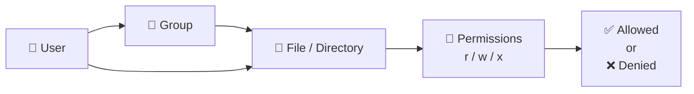

# 👥 Users, Groups & Permissions

> Managing identities, access, ownership, and privileges in Linux.

---

## On This Page

- [Quick Cheat Sheet](#quick-cheat-sheet)
- [Overview](#overview)
- [Access Control Model](#access-control-model)
- [Core Topics](#core-topics)

---

## Quick Cheat Sheet

| Command | Purpose |
|---|---|
| `id USER` | Show user and group information |
| `useradd USER` | Create user |
| `usermod` | Modify user |
| `userdel USER` | Delete user |
| `groupadd GROUP` | Create group |
| `passwd USER` | Set password |
| `chown` | Change ownership |
| `chmod` | Change permissions |
| `sudo` | Run command with elevated privileges |
| `umask` | Control default permissions |

---

## Overview

Linux access control is built around three main ideas:

```text
Users
  +
Groups
  +
Permissions
```

A file typically has:

```text
Owner
Group
Permissions
```

Example:

```text
-rwxr-x--- alice developers script.sh
```

Meaning:

```text
Owner → alice
Group → developers
Access → controlled by rwx permissions
```

---

## Access Control Model



---

## Core Topics

```text
03-Users-Groups-Permissions/
├── README.md
├── users.md
├── groups.md
├── useradd-usermod.md
├── passwd.md
├── sudo.md
├── ownership.md
├── chmod.md
├── umask.md
├── special-permissions.md
└── troubleshooting.md
```

### Users & Groups

Manage local identities and memberships.

### Passwords

Control authentication using:

```bash
passwd
```

### sudo

Delegate administrative privileges without sharing the root password.

### Ownership

Every file belongs to:

```text
User + Group
```

### Permissions

Linux uses:

```text
r = read
w = write
x = execute
```

### Special Permissions

Advanced controls include:

```text
SUID
SGID
Sticky Bit
```

---

## Key Mental Model

```text
Identity
   ↓
Group Membership
   ↓
Ownership
   ↓
Permissions
   ↓
Access
```

---

## Related Chapters

- `../02-File-System/`
- `../05-Processes-Systemd/`
- `../10-Security/`

---

## Conclusion

Linux security starts with knowing:

```text
Who is the user?
Which groups do they belong to?
Who owns the file?
What permissions apply?
```

These concepts form the foundation of Linux access control.