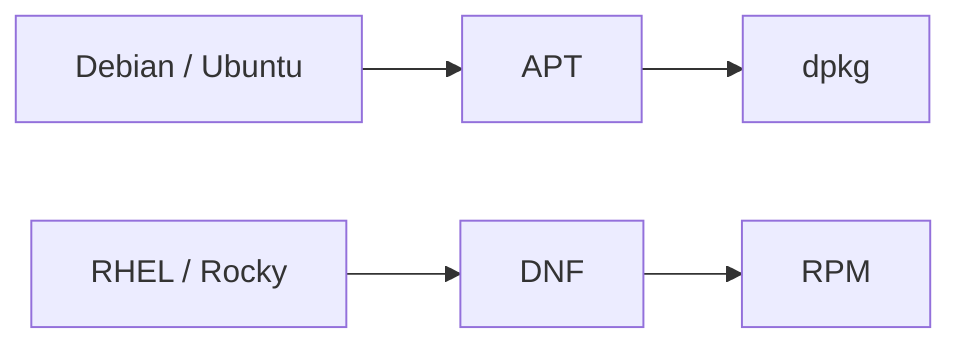

# 📦 Linux Package Management

> Installing, updating, removing, and troubleshooting software packages.

---

## On This Page

- [Quick Cheat Sheet](#quick-cheat-sheet)
- [Overview](#overview)
- [High-Level vs Low-Level Tools](#high-level-vs-low-level-tools)
- [Repository Model](#repository-model)
- [Topics](#topics)

---

## Quick Cheat Sheet

| Command | Purpose |
|---|---|
| `apt install PACKAGE` | Install package on Debian/Ubuntu |
| `apt remove PACKAGE` | Remove package |
| `apt update` | Refresh package metadata |
| `dnf install PACKAGE` | Install package on RHEL/Rocky |
| `dnf remove PACKAGE` | Remove package |
| `dnf upgrade` | Update installed packages |
| `dpkg -i FILE.deb` | Install local DEB |
| `rpm -ivh FILE.rpm` | Install local RPM |

---

## Overview

Linux distributions use package managers to handle software.

A package may contain:

```text
Application
Libraries
Configuration
Metadata
Dependencies
```

Two major package ecosystems are:

```text
Debian / Ubuntu
→ DEB packages

RHEL / Rocky / Fedora
→ RPM packages
```

---

## High-Level vs Low-Level Tools



High-level tools:

```text
APT
DNF
```

handle:

- Dependencies
- Repositories
- Updates

Low-level tools:

```text
dpkg
rpm
```

work directly with package files and metadata.

---

## Repository Model

Most packages are installed from repositories:

```text
Linux System
     ↓
Package Manager
     ↓
Repository Metadata
     ↓
Package Download
     ↓
Installation
```

Repositories provide:

- Package versions
- Dependencies
- Updates
- Security fixes

---

## Topics

```text
04-Package-Managers/
├── README.md
├── apt.md
├── dpkg.md
├── dnf.md
├── rpm.md
├── repositories.md
└── troubleshooting.md
```

### APT & dpkg

Used mainly on:

```text
Debian
Ubuntu
```

### DNF & RPM

Used mainly on:

```text
RHEL
Rocky Linux
Fedora
AlmaLinux
```

### Repositories

Covers package sources and repository configuration.

### Troubleshooting

Covers:

- Dependency problems
- Broken repositories
- Package conflicts
- Cache issues

---

## Key Mental Model

```text
Repository
   ↓
Package Manager
   ↓
Dependencies
   ↓
Package Installation
   ↓
Installed Software
```

---

## Related Chapters

- `../01-Basic-CLI/`
- `../05-Processes-Systemd/`
- `../10-Security/`

---

## Conclusion

Package managers provide a consistent way to install and maintain software.

The essential relationship is:

```text
APT → dpkg
DNF → RPM
```

For day-to-day administration, use the high-level package manager first.