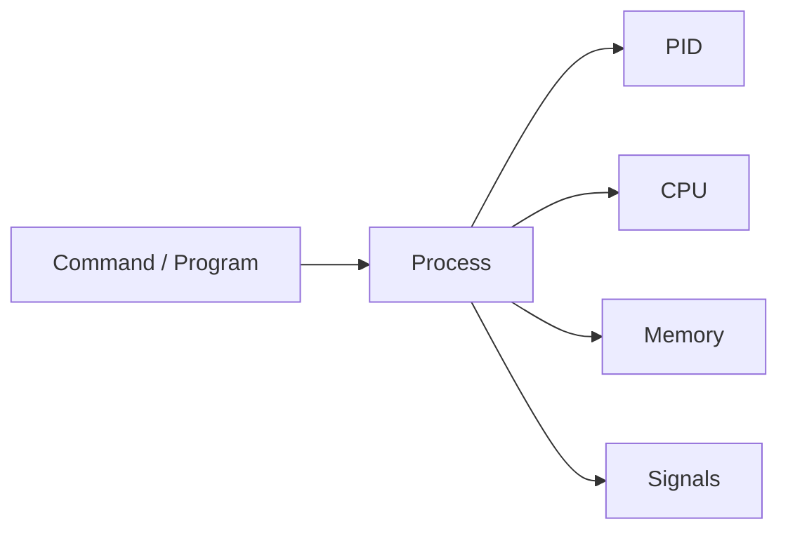

# ⚙️ Processes & systemd

> Managing running processes, services, signals, logs, and system startup behavior.

---

## On This Page

- [Quick Cheat Sheet](#quick-cheat-sheet)
- [Overview](#overview)
- [Process Model](#process-model)
- [systemd Model](#systemd-model)
- [Topics](#topics)

---

## Quick Cheat Sheet

| Command | Purpose |
|---|---|
| `ps aux` | Show running processes |
| `top` | Monitor processes live |
| `kill PID` | Send signal to process |
| `jobs` | Show shell jobs |
| `systemctl status SERVICE` | Check service |
| `systemctl start SERVICE` | Start service |
| `systemctl enable SERVICE` | Enable at boot |
| `journalctl -u SERVICE` | View service logs |

---

## Overview

Linux constantly runs processes.

A process may be:

```text
Shell command
Application
Background job
System service
Daemon
```

Each process has a:

```text
PID
Owner
State
CPU usage
Memory usage
```

---

## Process Model



Processes can be inspected, stopped, resumed, or terminated.

---

## systemd Model

Most modern Linux distributions use `systemd` to manage services.

```text
systemd
   ↓
Service Unit
   ↓
Process
   ↓
Logs
```

Example:

```bash
systemctl status nginx
```

Logs:

```bash
journalctl -u nginx
```

---

## Topics

```text
05-Processes-Systemd/
├── README.md
├── processes.md
├── ps.md
├── top.md
├── kill.md
├── jobs.md
├── signals.md
├── systemd.md
├── systemctl.md
├── journalctl.md
└── troubleshooting.md
```

### Processes

Understanding PID, PPID, process states, and ownership.

### ps & top

Inspect running processes and resource usage.

### kill & signals

Control process behavior using Linux signals.

### jobs

Manage shell foreground and background processes.

### systemd & systemctl

Manage services and system units.

### journalctl

Inspect system and service logs.

### Troubleshooting

Diagnose:

- Failed services
- High CPU
- Hung processes
- Restart loops
- Missing logs

---

## Key Mental Model

```text
Program
   ↓
Process
   ↓
Service
   ↓
systemd
   ↓
Logs
```

---

## Related Chapters

- `../01-Basic-CLI/`
- `../04-Package-Managers/`
- `../09-Logs-Monitoring/`

---

## Conclusion

Process management explains what is running.

`systemd` explains how long-running services are started, stopped, monitored, and restarted.

Together, they form the operational core of Linux administration.