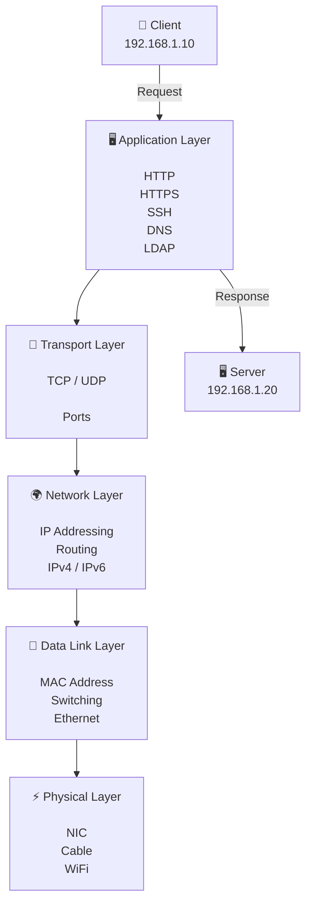

# 🌐 Networking Basics

> Understanding how Linux systems communicate.

---

# Overview

Computer networking allows Linux systems to exchange data with other devices, services, and applications.

Before configuring network interfaces or troubleshooting connectivity problems, Linux administrators need to understand fundamental networking concepts such as:

- Network models
- IP addressing
- Ports
- Protocols
- Routing
- DNS

These concepts form the foundation of modern infrastructure, containers, Kubernetes, and cloud platforms.

---




# 🏗️ Network Communication Model

A network connection can be understood as multiple layers working together:

```text
Application
     |
     v
Transport
     |
     v
Network
     |
     v
Data Link
     |
     v
Physical
```

Each layer has a specific responsibility in delivering data between systems.

---

# 📚 OSI Model

The OSI model describes network communication using seven layers.

| Layer | Name | Purpose |
|-|-|-|
| 7 | Application | User applications and services |
| 6 | Presentation | Data formatting and encryption |
| 5 | Session | Connection management |
| 4 | Transport | TCP and UDP communication |
| 3 | Network | IP addressing and routing |
| 2 | Data Link | MAC addresses and switching |
| 1 | Physical | Cables, signals, hardware |

Linux administrators mostly interact with:

- Layer 3 → IP networking
- Layer 4 → TCP/UDP ports
- Layer 7 → Applications and services

---

# 🌍 TCP/IP Model

The practical networking model used on the Internet is TCP/IP.

```text
Application Layer
        |
Transport Layer
        |
Internet Layer
        |
Network Access Layer
```

Examples:

| Layer | Examples |
|-|-|
| Application | HTTP, DNS, SSH |
| Transport | TCP, UDP |
| Internet | IPv4, IPv6 |
| Network Access | Ethernet, WiFi |

---

# 📍 IP Addressing

An IP address identifies a device on a network.

Example IPv4:

```text
192.168.1.50
```

An IP address contains:

- Network portion
- Host portion

Example:

```text
192.168.1.50/24
```

Means:

```text
Network:
192.168.1.0

Hosts:
192.168.1.1 - 192.168.1.254
```

---

# 🔢 IPv4 and IPv6

## IPv4

The traditional addressing system:

```text
192.168.10.25
```

Characteristics:

- 32-bit address
- Limited address space
- Widely used in internal networks

---

## IPv6

The modern addressing system:

```text
2001:db8::10
```

Characteristics:

- 128-bit address
- Extremely large address space
- Designed for future scalability

---

# 🚪 Ports and Services

An IP address identifies a machine.

A port identifies a service running on that machine.

Example:

```text
192.168.1.10:22
```

Means:

```text
Machine:
192.168.1.10

Service:
SSH

Port:
22
```

Common ports:

| Port | Service |
|-|-|
| 22 | SSH |
| 53 | DNS |
| 80 | HTTP |
| 443 | HTTPS |
| 389 | LDAP |
| 6443 | Kubernetes API |

---

# 🔄 TCP vs UDP

Transport protocols define how applications communicate.

## TCP

Transmission Control Protocol

Characteristics:

- Connection-oriented
- Reliable delivery
- Error checking
- Ordered communication

Examples:

- HTTP/HTTPS
- SSH
- Database connections


## UDP

User Datagram Protocol

Characteristics:

- Connectionless
- Faster
- No delivery guarantee

Examples:

- DNS queries
- Streaming
- Real-time applications

---

# 🧭 Routing

Routing determines how packets travel between networks.

A Linux system uses a routing table to decide:

- Where traffic should go
- Which gateway to use
- Which interface to send data through

Example:

```text
Source
  |
  v
Linux Host
  |
  v
Default Gateway
  |
  v
Destination Network
```

---

# 🏷️ DNS

DNS translates human-readable names into IP addresses.

Example:

```text
server.example.com

        |

        v

192.168.1.100
```

Linux uses:

```text
/etc/hosts

/etc/resolv.conf

DNS servers
```

---

# 🔐 Networking and Security

Networking concepts directly affect security.

Important areas:

- Open ports
- Firewall rules
- Encryption
- Authentication
- Network segmentation

Examples:

```text
SSH + Keys
HTTPS + TLS
Firewall + Filtering
VPN + Encryption
```

---

# 🐧 Networking in Modern Infrastructure

Linux networking is the foundation for:

```text
🐧 Linux
   |
   +-- 🐳 Containers
   |
   +-- ☸️ Kubernetes Networking
   |
   +-- 🌐 Cloud Networking
   |
   +-- 🏢 Enterprise Networks
```

---

# Conclusion

Networking basics provide the foundation for understanding how Linux systems communicate.

Before configuring interfaces, firewalls, or Kubernetes networking, administrators must understand IP addressing, protocols, ports, routing, and DNS.

Strong networking knowledge is one of the most valuable skills for Linux administrators and DevOps engineers.

