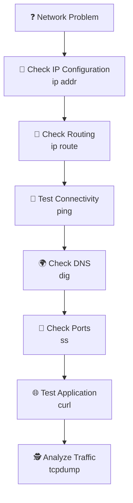

# 🛠️ Linux Network Commands

> Essential tools for observing, testing, and troubleshooting Linux networking.

---

# Overview

Linux provides powerful command-line tools to understand network behavior.

Network commands allow administrators to answer critical questions:

- 🌐 Do I have network connectivity?
- 📍 What is my IP address?
- 🚪 Which services are listening?
- 🔎 Does DNS work?
- 🔗 Can applications communicate?
- 🕵️ What is happening at packet level?

These tools are fundamental for Linux administration, containers, Kubernetes, and cloud environments.

---

# 🚦 Network Troubleshooting Mindset



---

# 🧰 Core Network Commands

| Command | Purpose | Problem It Solves |
|---|---|---|
| `ip` | Interface and route management | "What is my network configuration?" |
| `ss` | Socket inspection | "Is my service listening?" |
| `ping` | Connectivity testing | "Can I reach another host?" |
| `dig` | DNS queries | "Can I resolve this hostname?" |
| `curl` | Application testing | "Does this service respond?" |
| `tcpdump` | Packet analysis | "What is actually happening on the wire?" |

---

# 🌐 `ip`

## What problem does it solve?

Understanding and configuring:

- Network interfaces
- IP addresses
- Routes

## Basic syntax

```bash
ip <object> <command>
```

Examples:

```bash
ip addr

ip route

ip link
```

---

# 🔌 `ss`

## What problem does it solve?

Finding:

- Listening services
- Active connections
- Processes using ports

## Basic syntax

```bash
ss [options]
```

Examples:

```bash
ss -tuln

sudo ss -tulpn
```

---

# 📡 `ping`

## What problem does it solve?

Testing basic network reachability.

Example:

```bash
ping 192.168.1.10
```

Answers:

> "Can my machine communicate with this host?"

---

# 🔎 `dig`

## What problem does it solve?

Troubleshooting DNS.

Example:

```bash
dig example.com
```

Answers:

> "Can this hostname be translated into an IP address?"

---

# 🌍 `curl`

## What problem does it solve?

Testing application communication.

Examples:

```bash
curl https://example.com
```

or:

```bash
curl localhost:8080
```

Answers:

> "Is the application responding?"

---

# 🕵️ `tcpdump`

## What problem does it solve?

Inspecting network packets.

Example:

```bash
sudo tcpdump -i ens33
```

Answers:

> "What is actually travelling through the network?"

---

# 🧪 Real Linux Troubleshooting Example

Problem:

```
My web application is not reachable.
```

Follow the layers:

```text
1. Check interface

ip addr


2. Check route

ip route


3. Check connectivity

ping server


4. Check DNS

dig hostname


5. Check service port

ss -tulpn


6. Test application

curl http://server:8080


7. Inspect packets

tcpdump
```

---

# ☸️ Connection to Kubernetes

These same concepts appear in Kubernetes:

```text
Linux Network Tools

        |

        v

Container Networking

        |

        v

Kubernetes Services

        |

        v

Ingress

        |

        v

NetworkPolicy
```

Examples:

| Linux Tool | Kubernetes Usage |
|---|---|
| `ip` | Pod and node networking |
| `ss` | Service and port troubleshooting |
| `ping` | Connectivity testing |
| `dig` | CoreDNS debugging |
| `curl` | Service/API testing |
| `tcpdump` | CNI/network debugging |

---

# 📚 Command Reference

| Command | Documentation |
|---|---|
| `ip` | `ip.md` |
| `ss` | `ss.md` |
| `ping` | `ping.md` |
| `dig` | `dig.md` |
| `curl` | `curl.md` |
| `tcpdump` | `tcpdump.md` |

---

# Conclusion

Linux network commands provide visibility into every layer of communication.

From checking an IP address to analyzing packets, these tools allow administrators to troubleshoot problems systematically and confidently.

Mastering these commands is essential for Linux administration and modern DevOps environments.