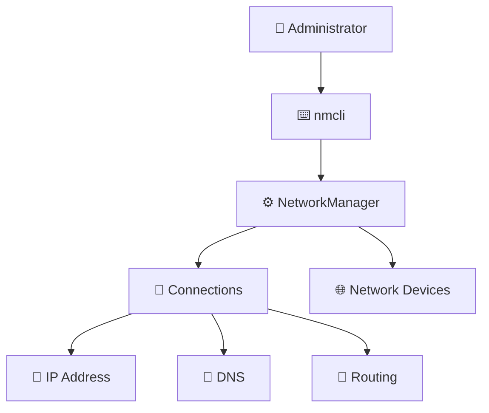

# ⚙️ Linux NetworkManager

> Managing Linux network configuration through modern network management tools.

---

# Overview

NetworkManager is the default network configuration service in most modern Linux distributions.

It manages:

- 🌐 Network interfaces
- 📍 IP addresses
- 🚪 Gateways
- 🔎 DNS configuration
- 📡 Wireless connections
- 🔐 VPN connections

It is widely used in:

- Rocky Linux
- RHEL
- Fedora
- Ubuntu Desktop

---

# 🧩 NetworkManager Architecture



---

# 🛠️ Main Tool

The primary command:

```bash
nmcli
```

Used for:

```text
View
Configure
Modify
Activate
Deactivate
```

---

# 📚 Topics

| Topic | Description |
|-|-|
| 📡 Devices | Network interfaces |
| 🔗 Connections | Saved network profiles |
| 📍 Static IP | Manual addressing |
| 🌐 DNS | Name resolution |
| 🧭 Routing | Gateway configuration |
| 🔧 Troubleshooting | Network problems |

---

# 🚀 Common Commands

Show devices:

```bash
nmcli device status
```

Show connections:

```bash
nmcli connection show
```

Show details:

```bash
nmcli connection show <name>
```

Activate connection:

```bash
nmcli connection up <name>
```

Deactivate:

```bash
nmcli connection down <name>
```

---

# 🏢 Enterprise Linux Example

A typical server:

```
Interface

ens192

   |

Connection Profile

static-ip-prod

   |

Configuration

IP
Gateway
DNS
Routes
```

---

# ☸️ DevOps Connection

NetworkManager is important for:

```text
Linux Host

    |

    v

Container Runtime

    |

    v

Kubernetes Node

    |

    v

Cluster Networking
```

It provides the foundation before:

- CNI plugins
- Kubernetes networking
- OpenShift networking

---

# 📂 Folder Structure

```
03-NetworkManager/

├── README.md

├── nmcli.md

├── connections.md

├── static-ip.md

├── dns-config.md

└── troubleshooting.md
```

---

# Conclusion

NetworkManager provides a consistent way to configure and manage Linux networking.

Understanding NetworkManager and `nmcli` is essential for Linux administrators managing modern servers, especially in Enterprise Linux environments.