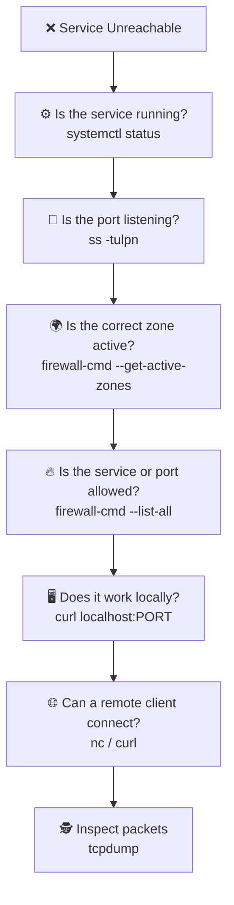

# 🛠️ firewalld Troubleshooting

> Diagnosing blocked ports, incorrect zones, missing rules, and unreachable services.

---

# 🎯 What Problem Does It Solve?

A service can fail for several different reasons:

- The application is stopped
- The port is not listening
- The firewall blocks traffic
- The rule exists in the wrong zone
- The rule is runtime-only
- The client is using the wrong IP or port

A structured workflow helps isolate the problem quickly.

---

# 🚦 Troubleshooting Flow



---

# 1️⃣ Check firewalld

Check the service:

```bash
systemctl status firewalld
```

Check firewall state:

```bash
firewall-cmd --state
```

Expected:

```text
running
```

Start it if necessary:

```bash
sudo systemctl start firewalld
```

---

# 2️⃣ Check the Application

Example:

```bash
systemctl status nginx
```

A firewall rule cannot help if the application is stopped.

Start it:

```bash
sudo systemctl start nginx
```

---

# 3️⃣ Check the Listening Port

Use:

```bash
sudo ss -tulpn
```

Check a specific port:

```bash
sudo ss -tulpn | grep 443
```

Expected:

```text
LISTEN 0.0.0.0:443
```

If nothing appears:

- The service is stopped
- The application uses another port
- The application configuration is wrong

---

# 4️⃣ Check the Active Zone

```bash
firewall-cmd --get-active-zones
```

Example:

```text
public
  interfaces: ens33
```

Check the interface directly:

```bash
firewall-cmd --get-zone-of-interface=ens33
```

---

# 5️⃣ Inspect Firewall Rules

Show the active zone:

```bash
firewall-cmd \
--zone=public \
--list-all
```

Check allowed services:

```bash
firewall-cmd \
--zone=public \
--list-services
```

Check allowed ports:

```bash
firewall-cmd \
--zone=public \
--list-ports
```

---

# 6️⃣ Check a Specific Rule

Check HTTPS:

```bash
firewall-cmd \
--zone=public \
--query-service=https
```

Check custom port:

```bash
firewall-cmd \
--zone=public \
--query-port=8080/tcp
```

Possible output:

```text
yes
```

or:

```text
no
```

---

# 7️⃣ Add the Missing Rule

Allow HTTPS:

```bash
sudo firewall-cmd \
--zone=public \
--add-service=https \
--permanent
```

Allow a custom port:

```bash
sudo firewall-cmd \
--zone=public \
--add-port=8080/tcp \
--permanent
```

Apply:

```bash
sudo firewall-cmd --reload
```

---

# 8️⃣ Compare Runtime and Permanent Rules

Runtime configuration:

```bash
firewall-cmd \
--zone=public \
--list-all
```

Permanent configuration:

```bash
firewall-cmd \
--zone=public \
--list-all \
--permanent
```

A rule may work now but disappear after reboot if it exists only at runtime.

Save tested runtime rules:

```bash
sudo firewall-cmd --runtime-to-permanent
```

---

# 9️⃣ Test Locally

For an HTTP application:

```bash
curl http://localhost:8080
```

For HTTPS:

```bash
curl -I https://localhost
```

If local access fails, the problem is probably the application rather than the firewall.

---

# 🔟 Test Remotely

From another machine:

```bash
nc -zv 192.168.1.50 8080
```

For HTTP:

```bash
curl http://192.168.1.50:8080
```

Interpretation:

| Result | Likely Meaning |
|---|---|
| Connection succeeded | Port is reachable |
| Connection refused | Host reachable, nothing listening |
| Connection timed out | Firewall or routing may block traffic |
| HTTP error response | Network works; investigate the application |

---

# 🕵️ Inspect Packets

Capture traffic on the server:

```bash
sudo tcpdump -i any port 8080
```

Then test from the client.

Interpretation:

```text
No packets arrive
```

Possible causes:

- Wrong destination IP
- Routing problem
- Upstream firewall
- Client-side problem

```text
Packets arrive, but no reply leaves
```

Possible causes:

- Local firewall
- Application problem
- Incorrect return route

---

# 🖥️ Real Linux Scenario

Problem:

```text
A web application on port 5000
cannot be reached remotely.
```

## Check the application

```bash
systemctl status myapp
```

## Check the port

```bash
sudo ss -tulpn | grep 5000
```

## Check the zone

```bash
firewall-cmd --get-active-zones
```

## Check the rule

```bash
firewall-cmd \
--zone=public \
--query-port=5000/tcp
```

## Add the rule

```bash
sudo firewall-cmd \
--zone=public \
--add-port=5000/tcp \
--permanent
```

## Reload

```bash
sudo firewall-cmd --reload
```

## Test remotely

```bash
curl http://server-ip:5000
```

---

# 🚨 Common Problems

## Rule Added to the Wrong Zone

Check:

```bash
firewall-cmd --get-active-zones
```

Inspect the zone assigned to the interface.

---

## Rule Disappeared After Reboot

Cause:

```text
Runtime-only rule
```

Fix:

```bash
sudo firewall-cmd \
--add-port=8080/tcp \
--permanent
```

Then:

```bash
sudo firewall-cmd --reload
```

---

## Port Is Allowed but Nothing Is Listening

Check:

```bash
sudo ss -tulpn
```

The firewall can allow traffic, but an application must still listen on the port.

---

## Service Is Listening Only on localhost

Example:

```text
127.0.0.1:8080
```

Remote clients cannot reach it.

Expected for remote access:

```text
0.0.0.0:8080
```

or the server’s interface IP.

Check:

```bash
sudo ss -tulpn | grep 8080
```

---

## TCP Rule Added for a UDP Service

Example:

```text
53/tcp
```

does not automatically allow:

```text
53/udp
```

Check both protocols when required.

---

# ☸️ DevOps Examples

## Harbor

```text
443/tcp
5000/tcp
```

## Kubernetes API

```text
6443/tcp
```

## kubelet

```text
10250/tcp
```

## NodePort

```text
30000-32767/tcp
```

Always confirm the required ports for the exact platform and architecture before opening broad ranges.

---

# 📚 Troubleshooting Checklist

| Question | Command |
|---|---|
| Is firewalld running? | `firewall-cmd --state` |
| Is the application running? | `systemctl status SERVICE` |
| Is the port listening? | `ss -tulpn` |
| Which zone is active? | `firewall-cmd --get-active-zones` |
| Is the service allowed? | `firewall-cmd --query-service=NAME` |
| Is the port allowed? | `firewall-cmd --query-port=PORT/PROTO` |
| Does it work locally? | `curl localhost:PORT` |
| Can a remote host connect? | `nc -zv HOST PORT` |
| Are packets arriving? | `tcpdump -i any port PORT` |

---

# Conclusion

Firewall troubleshooting should follow a clear order:

```text
Service
   ↓
Listening Port
   ↓
Active Zone
   ↓
Firewall Rule
   ↓
Local Test
   ↓
Remote Test
   ↓
Packet Capture
```

This workflow helps separate application problems from firewall, routing, and network problems.