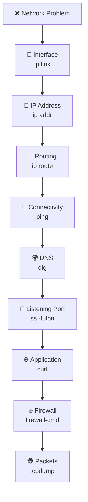

# 🛠️ Linux Network Troubleshooting

> A structured approach to diagnosing Linux network problems.

---

## 🎯 Goal

Network troubleshooting is not about running random commands.

The goal is to identify **where communication is failing**:

```text
Interface
   ↓
IP Address
   ↓
Routing
   ↓
Connectivity
   ↓
DNS
   ↓
Port
   ↓
Application
   ↓
Packets
```

---

## 🚦 Troubleshooting Workflow



---

## 🧰 Core Commands

| Command | Question |
|---|---|
| `ip link` | Is the interface active? |
| `ip addr` | Does the system have an IP address? |
| `ip route` | Is routing configured correctly? |
| `ping` | Can the destination be reached? |
| `dig` | Does DNS resolution work? |
| `ss -tulpn` | Is the service listening? |
| `curl` | Does the application respond? |
| `firewall-cmd` | Is traffic allowed? |
| `tcpdump` | Are packets arriving and leaving? |

---

## 🔍 Start Local, Then Move Outward

A useful testing order:

```text
1. Local system

2. Local interface

3. Default gateway

4. Remote IP address

5. DNS hostname

6. Remote port

7. Application response
```

Example:

```bash
ping 127.0.0.1
ping 192.168.1.1
ping 8.8.8.8
dig example.com
nc -zv example.com 443
curl -I https://example.com
```

---

## 🚨 Common Symptoms

| Symptom | Likely Area |
|---|---|
| No IP address | Interface, DHCP, NetworkManager |
| Local network works, Internet fails | Default route or gateway |
| IP works, hostname fails | DNS |
| Ping works, application fails | Port, service, or firewall |
| Connection refused | Nothing listening on the port |
| Connection timed out | Firewall, routing, or packet loss |
| Works locally but not remotely | Firewall or listening address |
| Intermittent connection | Packet loss, DNS, route, or interface |

---

## 🧪 Basic Diagnostic Sequence

```bash
nmcli device status
ip addr
ip route
ping -c 4 192.168.1.1
ping -c 4 8.8.8.8
dig example.com
ss -tulpn
curl -v https://example.com
firewall-cmd --list-all
tcpdump -i any
```

---

## 📂 Topics

```text
05-Troubleshooting/

├── README.md
├── connectivity.md
├── dns-issues.md
├── routing.md
├── packet-analysis.md
└── common-errors.md
```

| Page | Focus |
|---|---|
| `connectivity.md` | Interface, IP, gateway, and reachability |
| `dns-issues.md` | Resolver and hostname problems |
| `routing.md` | Routes, gateways, and network paths |
| `packet-analysis.md` | Diagnosing traffic with `tcpdump` |
| `common-errors.md` | Frequent symptoms and solutions |

---

## ☸️ DevOps Connection

The same troubleshooting logic applies to containers and Kubernetes:

```text
Linux Interface
      ↓
Node IP
      ↓
CNI Network
      ↓
Pod IP
      ↓
Service
      ↓
Ingress
      ↓
Application
```

Always verify the Linux host network before assuming the problem is inside Kubernetes.

---

## ✅ Quick Checklist

```text
□ NetworkManager is running

□ Interface is UP

□ IP address is assigned

□ Default route exists

□ Gateway is reachable

□ DNS resolves correctly

□ Service is listening

□ Firewall allows traffic

□ Application responds

□ Packets flow in both directions
```

---

## Conclusion

Effective network troubleshooting follows a clear path from the interface to the application.

By checking each layer in order, Linux administrators can isolate problems quickly instead of relying on guesswork.