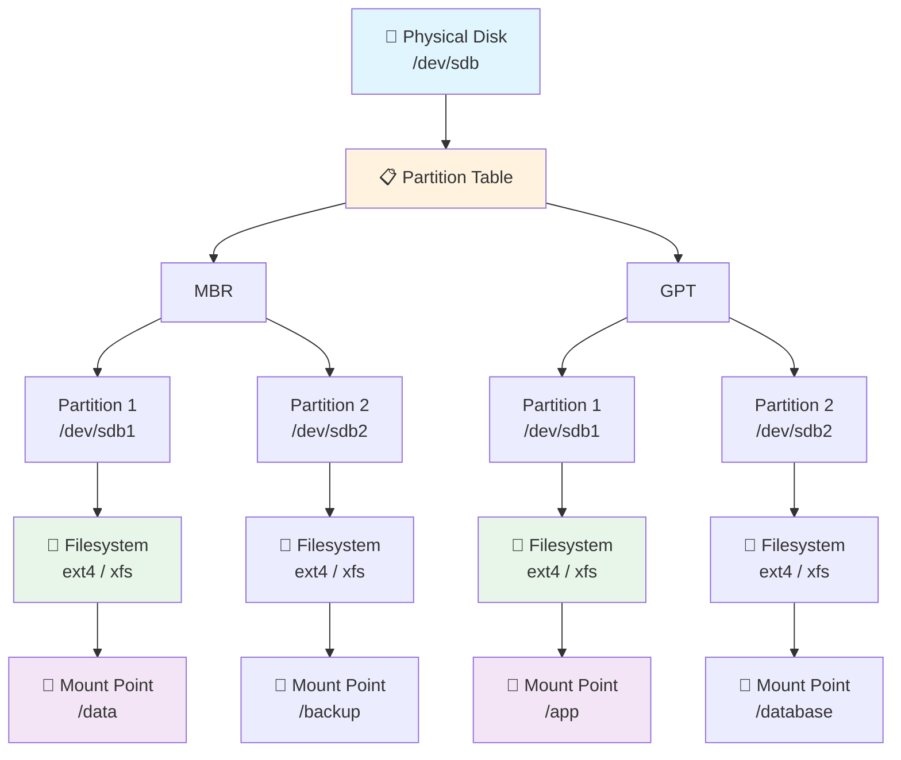

```mermaid
flowchart TB

    A["💽 Physical Disk<br>/dev/sdb"] --> B["📋 Partition Table"]

    B --> C["MBR"]
    B --> D["GPT"]

    C --> E["Partition 1<br>/dev/sdb1"]
    C --> F["Partition 2<br>/dev/sdb2"]

    D --> G["Partition 1<br>/dev/sdb1"]
    D --> H["Partition 2<br>/dev/sdb2"]

    E --> I["📁 Filesystem<br>ext4 / xfs"]
    F --> J["📁 Filesystem<br>ext4 / xfs"]

    G --> K["📁 Filesystem<br>ext4 / xfs"]
    H --> L["📁 Filesystem<br>ext4 / xfs"]

    I --> M["📂 Mount Point<br>/data"]
    J --> N["📂 Mount Point<br>/backup"]

    K --> O["📂 Mount Point<br>/app"]
    L --> P["📂 Mount Point<br>/database"]

    style A fill:#e1f5fe
    style B fill:#fff3e0
    style I fill:#e8f5e9
    style K fill:#e8f5e9
    style M fill:#f3e5f5
    style O fill:#f3e5f5
```