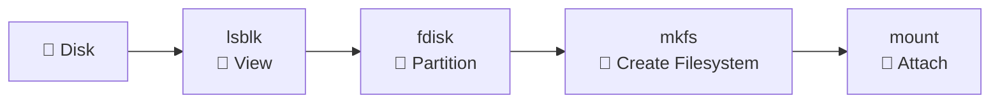

```mermaid
flowchart LR

    Disk["💽 Disk"]

    lsblk["lsblk<br>👀 View"]

    fdisk["fdisk<br>🔪 Partition"]

    mkfs["mkfs<br>📁 Create Filesystem"]

    mount["mount<br>📂 Attach"]

    Disk --> lsblk
    lsblk --> fdisk
    fdisk --> mkfs
    mkfs --> mount
```