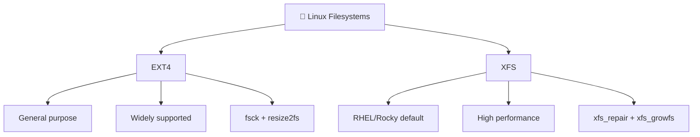

```mermaid
flowchart TB

    FS["📁 Linux Filesystems"]

    FS --> EXT4["EXT4"]

    FS --> XFS["XFS"]

    EXT4 --> E1["General purpose"]
    EXT4 --> E2["Widely supported"]
    EXT4 --> E3["fsck + resize2fs"]

    XFS --> X1["RHEL/Rocky default"]
    XFS --> X2["High performance"]
    XFS --> X3["xfs_repair + xfs_growfs"]
```