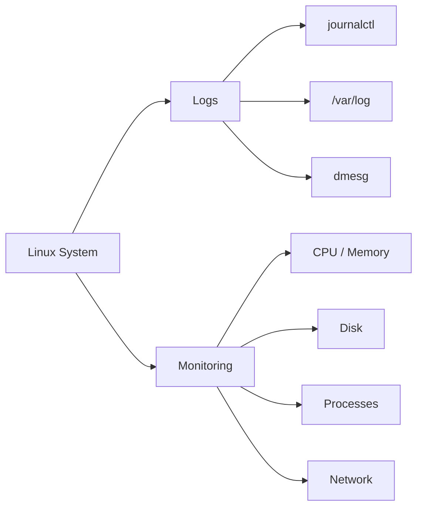

# 📊 Logs & Monitoring

> Understanding what happened on a Linux system and what is happening right now.

---

## On This Page

- [Quick Cheat Sheet](#quick-cheat-sheet)
- [Overview](#overview)
- [Logging vs Monitoring](#logging-vs-monitoring)
- [Core Tools](#core-tools)
- [Topics](#topics)

---

## Quick Cheat Sheet

| Command | Purpose |
|---|---|
| `journalctl` | Query systemd logs |
| `dmesg` | View kernel messages |
| `tail -f FILE` | Follow a log file |
| `top` | Monitor CPU and processes |
| `free -h` | Check memory |
| `df -h` | Check filesystem usage |
| `du -sh PATH` | Check directory size |
| `uptime` | Show uptime and load |
| `ss -tulpn` | Check sockets and ports |

---

## Overview

Linux troubleshooting usually starts with two questions:

```text
What happened?
     ↓
Logs

What is happening now?
     ↓
Monitoring
```

Logs record events that already occurred.

Monitoring shows the current state of the system.

---

## Logging vs Monitoring



Logging examples:

```text
Service failure
SSH login attempt
Kernel error
Application message
```

Monitoring examples:

```text
CPU usage
Memory pressure
Disk usage
Process state
Network connections
```

---

## Core Tools

System logs:

```bash
journalctl
```

Traditional logs:

```bash
ls /var/log
```

Kernel messages:

```bash
dmesg
```

Live log monitoring:

```bash
tail -f /var/log/messages
```

System resources:

```bash
top
free -h
df -h
uptime
```

---

## Topics

```text
09-Logs-Monitoring/
├── README.md
├── logs-overview.md
├── journalctl.md
├── rsyslog.md
├── log-files.md
├── logrotate.md
├── dmesg.md
├── monitoring-basics.md
├── cpu-memory.md
├── disk-monitoring.md
├── process-monitoring.md
├── network-monitoring.md
├── uptime-load.md
└── troubleshooting.md
```

---

## Key Mental Model

```text
Problem
   ↓
Check logs
   ↓
Check current resources
   ↓
Find affected component
   ↓
Identify root cause
```

---

## Related Chapters

- `../05-Processes-Systemd/`
- `../06-Networking/`
- `../07-Storage/`
- `../08-Shell-Scripting/`

---

## Conclusion

Linux observability begins with a small set of tools:

```text
journalctl
top
free
df
ss
dmesg
```

Together, they provide a strong foundation for troubleshooting and monitoring Linux systems.