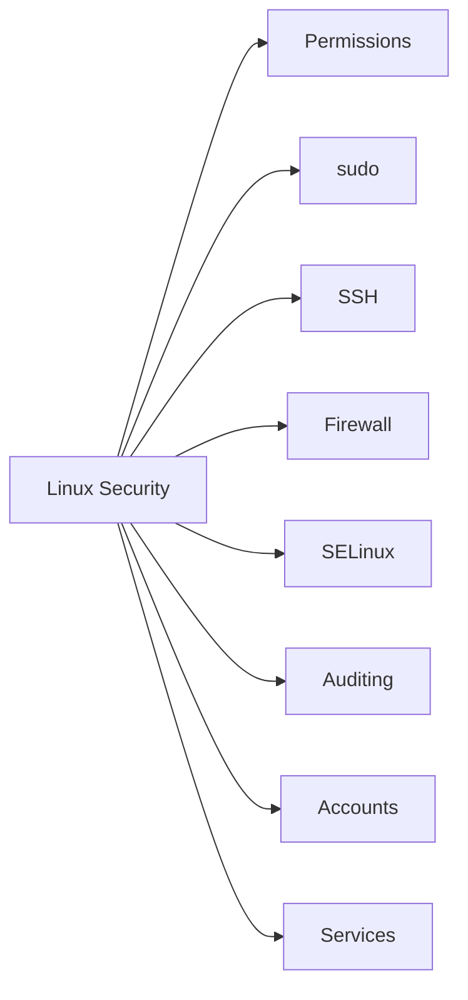

# 🔐 Linux Security

> Core Linux security practices for protecting users, services, files, and network access.

---

## On This Page

- [Quick Cheat Sheet](#quick-cheat-sheet)
- [Overview](#overview)
- [Core Security Areas](#core-security-areas)
- [Security Workflow](#security-workflow)
- [Files in This Folder](#files-in-this-folder)
- [Why This Matters](#why-this-matters)

---

## Quick Cheat Sheet

| Area | Typical Tool / Command |
|---|---|
| Permissions | `chmod`, `chown` |
| Privilege | `sudo`, `visudo` |
| SSH | `/etc/ssh/sshd_config` |
| Firewall | `firewall-cmd`, `ufw` |
| SELinux | `getenforce`, `semanage` |
| Auditing | `auditctl`, `ausearch` |
| Accounts | `passwd`, `chage`, `usermod` |
| Services | `systemctl` |

---

## Overview

Linux security is built from several layers.

A useful mental model is:

```text
Users
  ↓
Permissions
  ↓
Privilege Control
  ↓
Network Access
  ↓
Service Hardening
  ↓
Audit & Monitoring
```

No single setting makes a system secure.

Security comes from combining multiple controls.

---

## Core Security Areas



Typical goals include:

```text
Limit unnecessary access
Reduce privileges
Protect remote login
Restrict network exposure
Enforce mandatory controls
Record important activity
Disable unnecessary services
```

---

## Security Workflow

A practical approach:

```text
Identify what must be protected
        ↓
Limit users and permissions
        ↓
Restrict privilege escalation
        ↓
Secure remote access
        ↓
Limit exposed ports
        ↓
Enable security controls
        ↓
Audit and monitor
```

---

## Files in This Folder

```text
10-Security/
├── README.md
├── file-permissions-review.md
├── sudo-security.md
├── ssh-security.md
├── firewall-basics.md
├── selinux.md
├── auditd.md
├── account-security.md
├── service-hardening.md
└── troubleshooting.md
```

---

## Why This Matters

Security mistakes often come from:

```text
Overly broad permissions
Weak sudo rules
Exposed services
Poor SSH configuration
Disabled security controls
Unused accounts
Missing audit information
```

Linux administrators should be able to identify and reduce these risks without disrupting required services.

---

## Key Principle

Use the principle of least privilege:

```text
Give users and services
only the access they need
and nothing more.
```

---

## Related Chapters

- `../03-Users-Groups-Permissions/`
- `../05-Processes-Systemd/`
- `../06-Networking/`
- `../09-Logs-Monitoring/`

---

## Conclusion

Linux security is layered.

A strong baseline combines:

```text
Permissions
+
sudo
+
SSH hardening
+
Firewall
+
SELinux
+
Auditing
+
Monitoring
```

The goal is not to disable everything.

The goal is to reduce unnecessary exposure while keeping the system usable and maintainable.