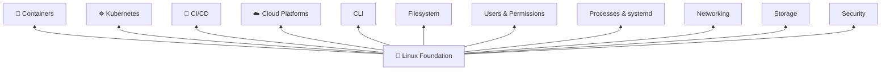

# Linux System Administration

```mermaid
flowchart BT

    K8S["☸️ Kubernetes"]
    CONTAINER["🐳 Containers"]
    CICD["🚀 CI/CD"]
    CLOUD["☁️ Cloud Platforms"]

    LINUX["🐧 Linux Foundation"]

    LINUX --> CONTAINER
    LINUX --> K8S
    LINUX --> CICD
    LINUX --> CLOUD


    LINUX --> CLI["CLI"]
    LINUX --> FS["Filesystem"]
    LINUX --> USERS["Users & Permissions"]
    LINUX --> SYSTEMD["Processes & systemd"]
    LINUX --> NETWORK["Networking"]
    LINUX --> STORAGE["Storage"]
    LINUX --> SECURITY["Security"]

```
