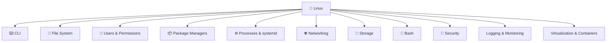

# 🐧 Linux System Administration

> The foundation of modern infrastructure, containers, and cloud platforms.

---

## 🚀 Linux Roadmap



---

## 📚 Core Topics

| | |
|-|-|
| ⌨️ **CLI** | Commands & Shell |
| 📁 **File System** | Hierarchy & Files |
| 👥 **Users** | Identity & Access |
| 📦 **Packages** | apt / dnf / rpm |
| ⚙️ **Processes** | Services & systemd |
| 🌐 **Networking** | TCP/IP & Tools |
| 💾 **Storage** | Disks & LVM |
| 🔐 **Security** | SSH & SELinux |
| 📜 **Scripting** | Automation |

---

## 🏗️ Linux Foundation

```text
🐧 Linux
   |
   +-- 🐳 Containers
   |
   +-- ☸️ Kubernetes
   |
   +-- 🚀 CI/CD
   |
   +-- ☁️ Cloud
```

---

## 🎯 Goal

Build strong Linux administration skills:

✅ Manage servers  
✅ Understand system behavior  
✅ Automate tasks  
✅ Support modern DevOps platforms  

---

## 🛠️ Environment

- 🟥 Rocky Linux / RHEL
- 🟦 Ubuntu / Debian
- 🐧 CentOS Stream
- 🐳 Podman & Containers
- ☸️ Kubernetes Nodes
