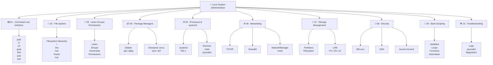

# Linux System Administration

```mermaid
flowchart TB

    LINUX["🐧 Linux System Administration"]

    LINUX --> CLI["⌨️ 01 - Command Line Interface"]
    LINUX --> FS["📁 02 - File System"]
    LINUX --> UGP["👥 03 - Users Groups Permissions"]
    LINUX --> PKG["📦 04 - Package Managers"]
    LINUX --> PROC["⚙️ 05 - Processes & systemd"]
    LINUX --> NET["🌐 06 - Networking"]
    LINUX --> STORAGE["💾 07 - Storage Management"]
    LINUX --> SEC["🔐 08 - Security"]
    LINUX --> SCRIPT["📜 09 - Bash Scripting"]
    LINUX --> TROUBLE["🛠️ 10 - Troubleshooting"]


    CLI --> COMMANDS["pwd\nls\ncd\ngrep\nfind\nawk\nsed"]

    FS --> HIER["Filesystem Hierarchy\n/\n/etc\n/var\n/home\n/usr"]

    UGP --> USERS["Users\nGroups\nOwnership\nPermissions"]

    PKG --> DEB["Debian\napt / dpkg"]
    PKG --> RPM["Enterprise Linux\nrpm / dnf"]

    PROC --> SYSTEMD["systemd\nPID 1"]
    PROC --> SERVICES["Services\nUnits\njournalctl"]

    NET --> TCPIP["TCP/IP"]
    NET --> FIREWALL["firewalld"]
    NET --> NM["NetworkManager\nnmcli"]

    STORAGE --> DISK["Partitions\nFilesystem"]
    STORAGE --> LVM["LVM\nPV / VG / LV"]

    SEC --> SELINUX["SELinux"]
    SEC --> SSH["SSH"]
    SEC --> ACL["Access Control"]

    SCRIPT --> BASH["Variables\nLoops\nFunctions\nAutomation"]

    TROUBLE --> LOGS["Logs\njournalctl\ndiagnostics"]

```
