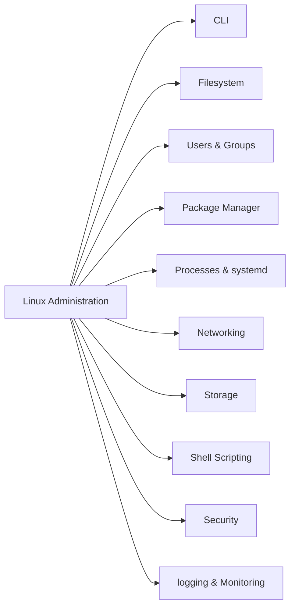

# Linux System Administration

```mermaid
flowchart LR

A[Linux Administration]

A --> B[CLI]
A --> C[Filesystem]
A --> D[Users & Groups]
A --> E[Package Manager]
A --> F[Processes & systemd]
A --> G[Networking]
A --> H[Storage]
A --> I[Shell Scripting]
A --> J[Security]
A --> K[logging & Monitoring]

```
