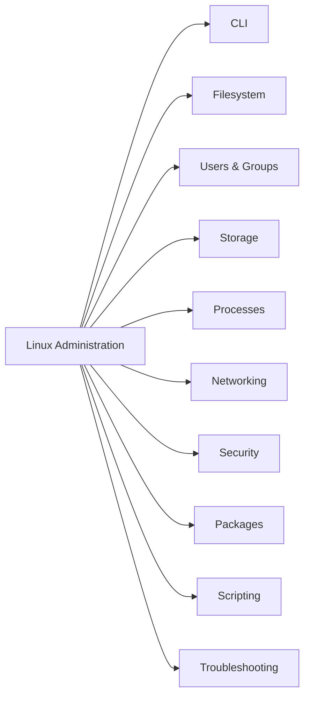

# Linux System Administration

```mermaid
flowchart LR

A[Linux Administration]

A --> B[CLI]
A --> C[Filesystem]
A --> D[Users & Groups]
A --> E[Storage]
A --> F[Processes]
A --> G[Networking]
A --> H[Security]
A --> I[Packages]
A --> J[Scripting]
A --> K[Troubleshooting]

```
