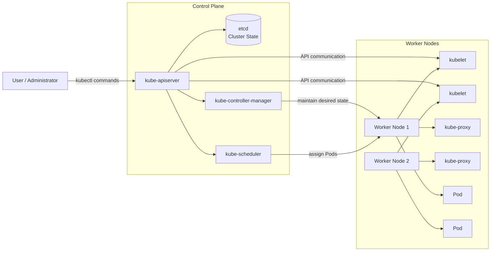

```mermaid
flowchart LR

    USER[User / Administrator]
    
    USER -->|kubectl commands| API

    subgraph CONTROL[Control Plane]
        API[kube-apiserver]
        ETCD[(etcd\nCluster State)]
        SCHED[kube-scheduler]
        CM[kube-controller-manager]
    end

    API --> ETCD
    API --> SCHED
    API --> CM

    SCHED -->|assign Pods| NODE1
    CM -->|maintain desired state| NODE1

    subgraph WORKERS[Worker Nodes]
        NODE1[Worker Node 1]
        NODE2[Worker Node 2]

        KUBELET1[kubelet]
        KUBELET2[kubelet]

        KPROXY1[kube-proxy]
        KPROXY2[kube-proxy]

        POD1[Pod]
        POD2[Pod]
    end

    NODE1 --> KUBELET1
    NODE1 --> KPROXY1
    NODE1 --> POD1

    NODE2 --> KUBELET2
    NODE2 --> KPROXY2
    NODE2 --> POD2

    API -->|API communication| KUBELET1
    API -->|API communication| KUBELET2

```
