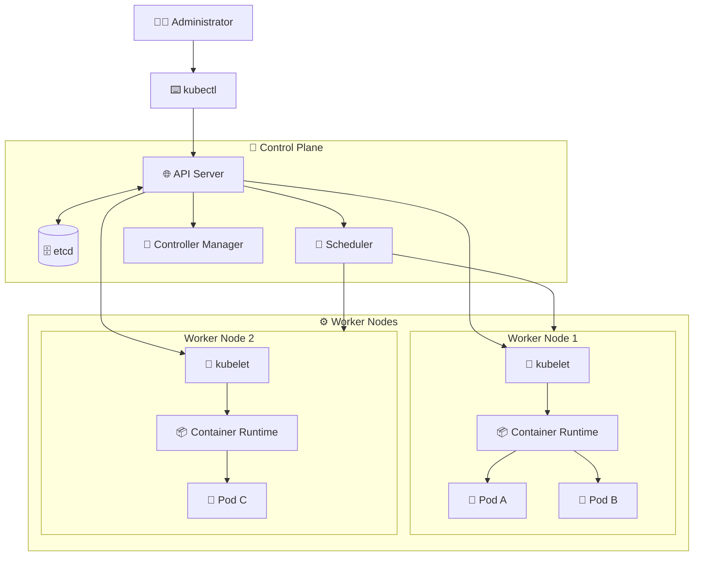

# Kubernetes Cluster Architecture ☸️

## 1. Overview

Kubernetes is an open-source platform used to deploy, manage, scale, and maintain containerized applications.

A Kubernetes environment is called a **cluster**. The cluster is mainly divided into two parts:

* 🧠 **Control Plane** — manages and coordinates the cluster
* ⚙️ **Worker Nodes** — run application workloads

Administrators interact with the cluster using tools such as `kubectl`. Requests are sent to the Kubernetes API server, and the control plane determines how the desired state should be achieved.

For example, when an administrator requests three replicas of an application, Kubernetes schedules the required Pods across available worker nodes. If a Pod or node fails, Kubernetes attempts to restore the requested state automatically.

This continuous process is known as **reconciliation**.

---

## 2. Cluster Architecture



---

## 3. Control Plane 🧠

The control plane manages the cluster and makes global decisions.

Its main components are:

* **API Server** — the main entry point into Kubernetes
* **etcd** — stores the cluster configuration and state
* **Scheduler** — selects worker nodes for new Pods
* **Controller Manager** — monitors resources and corrects differences between the current and desired states

In a highly available production cluster, multiple control-plane nodes may be used.

---

## 4. Worker Nodes ⚙️

Worker nodes provide the CPU, memory, networking, and storage required to run applications.

Each worker node normally contains:

* **kubelet** — communicates with the control plane and manages Pods
* **Container runtime** — runs containers, commonly containerd
* **kube-proxy or an equivalent networking component** — supports Service networking
* **Pods** — contain the application containers

The control plane manages workloads, but the worker nodes perform the actual application work.

---

## 5. Cheat Sheet

```bash
kubectl cluster-info
kubectl get nodes
kubectl get nodes -o wide
kubectl describe node <node-name>
kubectl get pods -A
kubectl get componentstatuses
```

> `kubectl get componentstatuses` may be deprecated or unavailable in newer Kubernetes environments.

---

## 6. Common Problems 🚨

* Worker node appears as `NotReady`
* API server cannot be reached
* Pods remain in `Pending`
* Insufficient CPU or memory
* Container runtime is unavailable
* Network plugin is not functioning
* etcd loses quorum

---

## 7. Interview Questions 🎯

1. What is a Kubernetes cluster?
2. What is the difference between the control plane and a worker node?
3. What information is stored in etcd?
4. What does the Kubernetes scheduler do?
5. What is the role of the kubelet?
6. What happens when a Pod fails?
7. Why are multiple control-plane nodes used?

---

## 8. Related Topics 🔗

* Kubernetes Objects
* Pods
* Deployments
* Services
* Scheduling
* etcd
* kubelet
* Container Runtime
