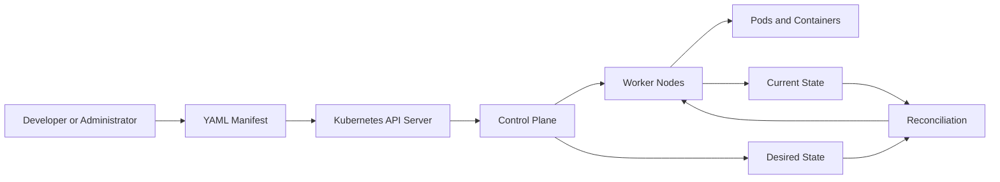

# What Is Kubernetes?

## 1. Overview




---

## 2. Syntax and Cheat Sheet

Check the cluster:

```bash
kubectl cluster-info
```

List cluster nodes:

```bash
kubectl get nodes
```

List Pods:

```bash
kubectl get pods
```

List common resources:

```bash
kubectl get all
```

Display detailed information:

```bash
kubectl describe pod <pod-name>
```

Create a resource from YAML:

```bash
kubectl apply -f application.yaml
```

Delete a resource:

```bash
kubectl delete -f application.yaml
```

General command structure:

```text
kubectl <action> <resource> <resource-name>
```

Example:

```bash
kubectl get pod nginx
```

---

## 3. Practical Example

Suppose an online store runs three instances of its frontend application.

If one container crashes, Kubernetes can replace it. If one worker node fails, Kubernetes can recreate the affected workload on another available node. If traffic increases, the number of application replicas can be increased.

When a new application version is released, Kubernetes can gradually replace the old Pods with new ones. This allows the application to remain available during the update.

The administrator describes the desired state, while Kubernetes performs the continuous operational work required to maintain it.

---

## 4. YAML Example

```yaml
apiVersion: apps/v1
kind: Deployment
metadata:
  name: web-application
spec:
  replicas: 3
  selector:
    matchLabels:
      app: web
  template:
    metadata:
      labels:
        app: web
    spec:
      containers:
        - name: web
          image: nginx:latest
          ports:
            - containerPort: 80
```

This Deployment requests three Pods running the NGINX container image.

---

## 5. Common Problems

* Insufficient CPU or memory prevents Pods from being scheduled.
* Incorrect YAML indentation causes manifest errors.
* Container images cannot be downloaded.
* Applications start but are not exposed through a Service.
* Pods repeatedly restart because of application failures.
* Missing networking or storage components affect workloads.

---

## 6. Interview Questions

1. What problem does Kubernetes solve?
2. What is a Kubernetes cluster?
3. What is the difference between a container and a Pod?
4. What does desired state mean in Kubernetes?
5. What is reconciliation?
6. What is the role of the control plane?
7. Does Kubernetes build container images?

---

## 7. Related Topics

* Kubernetes Cluster
* Control Plane
* Worker Nodes
* Pods
* Deployments
* Services
* Declarative Configuration
* `kubectl`
