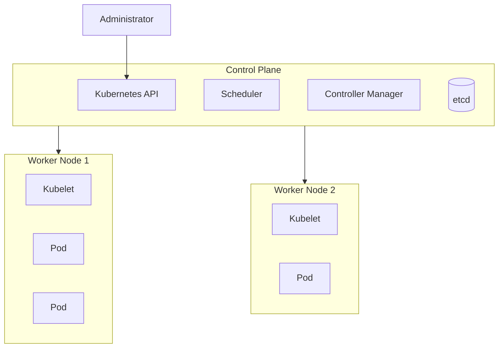

# Kubernetes Cluster

## 1. Overview



A Kubernetes cluster is a group of machines that work together to run containerized applications. It normally contains a **control plane**, which manages the cluster, and one or more **worker nodes**, which run application workloads.

The control plane stores the desired state of the cluster and makes decisions about scheduling, scaling, and recovery. Worker nodes provide the CPU, memory, networking, and container runtime required to run Pods.

Clusters may run on physical servers, virtual machines, local development systems, or public cloud platforms. A production cluster often contains multiple control-plane and worker nodes to improve availability and fault tolerance.

## 2. Syntax and Cheat Sheet

Display cluster information:

```bash
kubectl cluster-info
```

List nodes:

```bash
kubectl get nodes
```

Show detailed node information:

```bash
kubectl describe node <node-name>
```

Display the current Kubernetes context:

```bash
kubectl config current-context
```

List available contexts:

```bash
kubectl config get-contexts
```

View cluster component endpoints:

```bash
kubectl get endpoints -n default
```

## 3. Practical Example

Suppose a cluster contains three worker nodes and runs a web application with six replicas.

The Kubernetes scheduler distributes the Pods across available nodes. If one worker node fails, the Pods on that node become unavailable. Controllers detect that the desired number of replicas is no longer running and create replacement Pods on the remaining healthy nodes.

This behavior allows the application to recover without an administrator manually restarting each container.

## 4. YAML Example

The following Pod can be submitted to a cluster:

```yaml
apiVersion: v1
kind: Pod
metadata:
  name: cluster-test
spec:
  containers:
    - name: nginx
      image: nginx:latest
      ports:
        - containerPort: 80
```

Apply it:

```bash
kubectl apply -f cluster-test.yaml
```

Kubernetes selects an appropriate worker node and asks its kubelet to run the Pod.

## 5. Common Problems

* Nodes appear as `NotReady` because of kubelet, networking, or runtime issues.
* Pods remain `Pending` because the cluster lacks sufficient resources.
* `kubectl` cannot connect because the kubeconfig or API endpoint is incorrect.
* A single-node cluster has no workload redundancy.
* Network or DNS failures prevent communication between cluster components.

## 6. Interview Questions

1. What are the main components of a Kubernetes cluster?
2. What is the difference between a control-plane node and a worker node?
3. What happens to workloads when a worker node fails?
4. Can a Kubernetes cluster contain only one node?
5. Why are multiple control-plane nodes used in production?

## 7. Related Topics

* Control Plane
* Worker Nodes
* Kubernetes API Server
* Scheduler
* etcd
* Kubelet
* High Availability
