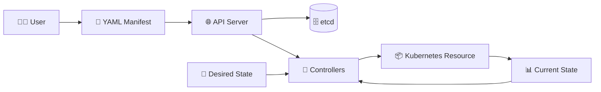

# Kubernetes Objects 📦

## 1. Overview

Kubernetes objects represent the **desired state** of the cluster.

When an object is created, Kubernetes stores its definition and continuously works to keep the actual state aligned with the requested state.

Common Kubernetes objects include:

* 🚀 Pod
* 📦 Deployment
* 🌐 Service
* 💾 PersistentVolumeClaim
* 🔐 Secret
* ⚙️ ConfigMap
* 👤 ServiceAccount
* 🗂️ Namespace

---

## 2. Object Lifecycle



---

## 3. Object Anatomy

Most Kubernetes manifests contain these main fields:

| Field        | Purpose                                  |
| ------------ | ---------------------------------------- |
| `apiVersion` | API version used by the resource         |
| `kind`       | Type of Kubernetes object                |
| `metadata`   | Name, namespace, labels, and annotations |
| `spec`       | Desired configuration                    |
| `status`     | Current state reported by Kubernetes     |

The user normally defines the `spec`, while Kubernetes manages the `status`.

---

## 4. Syntax and Cheat Sheet

```bash
kubectl get pods
kubectl get deployments
kubectl get services
kubectl get all
kubectl describe pod <pod-name>
kubectl apply -f object.yaml
kubectl delete -f object.yaml
kubectl explain pod
kubectl explain deployment.spec
```

List available API resources:

```bash
kubectl api-resources
```

View an object as YAML:

```bash
kubectl get pod <pod-name> -o yaml
```

---

## 5. YAML Example

```yaml
apiVersion: v1
kind: Pod
metadata:
  name: nginx-pod
  namespace: default
  labels:
    app: nginx
spec:
  containers:
    - name: nginx
      image: nginx:latest
      ports:
        - containerPort: 80
```

This manifest creates a Pod named `nginx-pod` in the `default` namespace.

---

## 6. Object Scope

Kubernetes objects can be either:

### 🗂️ Namespaced

Exist inside a namespace.

Examples:

* Pods
* Deployments
* Services
* ConfigMaps
* Secrets

### 🌍 Cluster-Scoped

Exist across the entire cluster.

Examples:

* Nodes
* Namespaces
* PersistentVolumes
* ClusterRoles
* StorageClasses

---

## 7. Common Problems 🚨

* Incorrect `apiVersion`
* Unsupported resource `kind`
* Invalid YAML indentation
* Missing required fields
* Resource created in the wrong namespace
* Immutable fields modified
* Labels do not match selectors

---

## 8. Interview Questions 🎯

1. What is a Kubernetes object?
2. What is the difference between `spec` and `status`?
3. What does desired state mean?
4. What is the purpose of `metadata`?
5. What is the difference between namespaced and cluster-scoped resources?
6. Where are Kubernetes objects stored?
7. What does `kubectl apply` do?

---

## 9. Related Topics 🔗

* YAML Manifests
* Pods
* Deployments
* Namespaces
* Labels and Selectors
* API Server
* etcd
* Controllers
