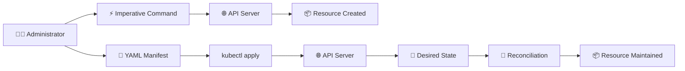

# Declarative vs Imperative Kubernetes ⚙️

## 1. Overview

Kubernetes resources can be managed in two main ways:

* ⚡ **Imperative** — tell Kubernetes exactly what action to perform
* 📄 **Declarative** — describe the desired final state in a YAML manifest

Imperative commands are useful for quick tests and simple tasks. Declarative configuration is preferred for production because manifests can be reviewed, version-controlled, reused, and applied consistently.

---

## 2. Workflow



---

## 3. Syntax and Cheat Sheet

### Imperative

```bash
kubectl run nginx --image=nginx
kubectl create deployment web --image=nginx
kubectl scale deployment web --replicas=3
kubectl expose deployment web --port=80
kubectl delete deployment web
```

### Declarative

```bash
kubectl apply -f deployment.yaml
kubectl apply -f manifests/
kubectl diff -f deployment.yaml
kubectl delete -f deployment.yaml
```

Generate YAML without creating the resource:

```bash
kubectl create deployment web \
  --image=nginx \
  --dry-run=client \
  -o yaml
```

---

## 4. Practical Example

An administrator needs to deploy three NGINX replicas.

Imperative approach:

```bash
kubectl create deployment web --image=nginx
kubectl scale deployment web --replicas=3
```

Declarative approach:

```bash
kubectl apply -f deployment.yaml
```

The declarative approach keeps the full configuration in one reusable file.

---

## 5. YAML Example

```yaml
apiVersion: apps/v1
kind: Deployment
metadata:
  name: web
spec:
  replicas: 3
  selector:
    matchLabels:
      app: web
  template:
    metadata:
      labels:
        app: web
    spec:
      containers:
        - name: nginx
          image: nginx:latest
```

---

## 6. Comparison

| Imperative                             | Declarative           |
| -------------------------------------- | --------------------- |
| Action-focused                         | State-focused         |
| Fast for testing                       | Better for production |
| Commands may be difficult to reproduce | YAML can be reused    |
| Limited change history                 | Works well with Git   |
| Useful for troubleshooting             | Ideal for GitOps      |

---

## 7. Common Problems 🚨

* Manual changes drift away from YAML files
* Resources are edited but changes are not committed
* `kubectl create` fails because the resource already exists
* Incorrect manifests overwrite valid configuration
* Multiple administrators apply conflicting changes

---

## 8. Interview Questions 🎯

1. What is the difference between imperative and declarative management?
2. Why is declarative configuration preferred in production?
3. What does `kubectl apply` do?
4. What is configuration drift?
5. What is the purpose of `--dry-run=client`?
6. How does declarative management support GitOps?

---

## 9. Related Topics 🔗

* YAML Manifests
* Kubernetes Objects
* `kubectl`
* Deployments
* Reconciliation
* GitOps
* Argo CD
