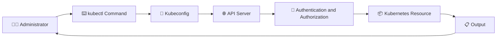

# kubectl ⌨️

## 1. Overview

`kubectl` is the command-line tool used to interact with a Kubernetes cluster.

It sends requests to the Kubernetes API server and allows administrators to create, inspect, update, troubleshoot, and delete cluster resources.

`kubectl` uses a **kubeconfig** file to determine:

* Which cluster to connect to
* Which user credentials to use
* Which namespace and context are active

---

## 2. How kubectl Works



---

## 3. Command Structure

```text
kubectl <command> <resource> <name> [flags]
```

Example:

```bash
kubectl get pod nginx -n production
```

| Part            | Meaning        |
| --------------- | -------------- |
| `get`           | Action         |
| `pod`           | Resource type  |
| `nginx`         | Resource name  |
| `-n production` | Namespace flag |

---

## 4. Cheat Sheet

### Cluster and Context

```bash
kubectl cluster-info
kubectl config get-contexts
kubectl config current-context
kubectl config use-context <context>
kubectl config set-context --current --namespace=<namespace>
```

### View Resources

```bash
kubectl get nodes
kubectl get pods
kubectl get pods -A
kubectl get pods -o wide
kubectl get deployments
kubectl get services
kubectl get all
```

### Inspect Resources

```bash
kubectl describe pod <pod-name>
kubectl get pod <pod-name> -o yaml
kubectl explain pod
kubectl explain deployment.spec
```

### Create and Update

```bash
kubectl apply -f manifest.yaml
kubectl apply -f manifests/
kubectl create -f manifest.yaml
kubectl edit deployment <name>
kubectl scale deployment <name> --replicas=3
kubectl set image deployment/<name> <container>=<image>
```

### Troubleshooting

```bash
kubectl logs <pod-name>
kubectl logs -f <pod-name>
kubectl logs <pod-name> -c <container>
kubectl exec -it <pod-name> -- /bin/sh
kubectl get events --sort-by=.metadata.creationTimestamp
kubectl port-forward pod/<pod-name> 8080:80
```

### Delete Resources

```bash
kubectl delete pod <pod-name>
kubectl delete -f manifest.yaml
kubectl delete deployment <name>
```

---

## 5. Practical Example

Deploy NGINX and inspect it:

```bash
kubectl create deployment web --image=nginx
kubectl get deployments
kubectl get pods -o wide
kubectl describe deployment web
kubectl logs <pod-name>
```

Expose the Deployment:

```bash
kubectl expose deployment web \
  --type=NodePort \
  --port=80
```

Verify the Service:

```bash
kubectl get services
```

---

## 6. YAML Example

Generate a Deployment manifest without creating it:

```bash
kubectl create deployment web \
  --image=nginx \
  --dry-run=client \
  -o yaml > deployment.yaml
```

Apply it:

```bash
kubectl apply -f deployment.yaml
```

---

## 7. Useful Output Formats

```bash
kubectl get pods -o wide
kubectl get pods -o yaml
kubectl get pods -o json
kubectl get pods -o name
kubectl get pods -o custom-columns=NAME:.metadata.name,NODE:.spec.nodeName
```

---

## 8. Common Problems 🚨

* Wrong context or cluster is active
* Resource exists in another namespace
* Kubeconfig is missing or invalid
* User does not have sufficient RBAC permissions
* Resource name or type is incorrect
* API server is unreachable
* Shell enters the wrong container in a multi-container Pod

---

## 9. Interview Questions 🎯

1. What is `kubectl`?
2. What information is stored in kubeconfig?
3. What is a Kubernetes context?
4. What is the difference between `create` and `apply`?
5. How do you inspect a failing Pod?
6. How do you run a command inside a container?
7. How do you switch the current namespace?
8. What does `-o wide` display?

---

## 10. Related Topics 🔗

* Kubeconfig
* Kubernetes API Server
* Contexts and Namespaces
* Kubernetes Objects
* YAML Manifests
* RBAC
* Logs and Events
* Troubleshooting
