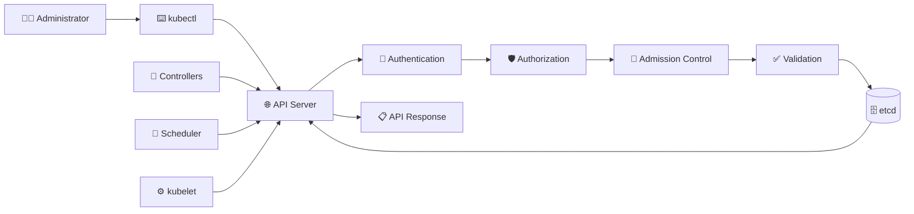

# Kubernetes API Server 🌐

## 1. Overview

The **Kubernetes API Server** is the main entry point to the cluster.

All requests from users, `kubectl`, controllers, schedulers, and external tools pass through the API server. It validates requests, checks permissions, updates cluster state, and communicates with `etcd`.

The API server is the central communication hub of the Kubernetes control plane.

---

## 2. Request Flow



---

## 3. Main Responsibilities

| Responsibility    | Description                                     |
| ----------------- | ----------------------------------------------- |
| API endpoint      | Receives REST API requests                      |
| Authentication    | Verifies the identity of the requester          |
| Authorization     | Checks whether the action is permitted          |
| Admission control | Applies policies before storing a resource      |
| Validation        | Verifies resource structure and required fields |
| State management  | Reads and writes cluster state through `etcd`   |
| Communication     | Connects control-plane and node components      |

Other Kubernetes components normally communicate through the API server rather than directly with `etcd`.

---

## 4. Syntax and Cheat Sheet

Display the API server address:

```bash
kubectl cluster-info
```

Display available API versions:

```bash
kubectl api-versions
```

List supported resource types:

```bash
kubectl api-resources
```

View raw API information:

```bash
kubectl get --raw /api
kubectl get --raw /apis
kubectl get --raw /version
```

Check access permissions:

```bash
kubectl auth can-i create deployments
kubectl auth can-i delete pods -n production
```

Start a local API proxy:

```bash
kubectl proxy
```

---

## 5. Practical Example

When an administrator runs:

```bash
kubectl apply -f deployment.yaml
```

The request follows this path:

1. `kubectl` reads the active kubeconfig.
2. The request is sent to the API server.
3. The user is authenticated.
4. RBAC permissions are checked.
5. Admission policies are applied.
6. The manifest is validated.
7. The desired state is stored in `etcd`.
8. Controllers and the scheduler react to the new resource.

---

## 6. API Request Example

After starting the proxy:

```bash
kubectl proxy
```

The local API can be queried:

```bash
curl http://127.0.0.1:8001/api/v1/nodes
```

A Deployment manifest targets the API server through its API version and resource type:

```yaml
apiVersion: apps/v1
kind: Deployment
metadata:
  name: web
spec:
  replicas: 3
```

---

## 7. Common Problems 🚨

* API server is unreachable
* Invalid or expired client certificate
* Incorrect kubeconfig server address
* RBAC returns `Forbidden`
* Invalid YAML returns a validation error
* Admission policy rejects the request
* Control-plane firewall blocks port `6443`
* API server cannot communicate with `etcd`

---

## 8. Interview Questions 🎯

1. What is the role of the Kubernetes API server?
2. Which components communicate with the API server?
3. Does the scheduler communicate directly with `etcd`?
4. What happens during authentication and authorization?
5. What is an admission controller?
6. What is normally stored in `etcd`?
7. Which port does the Kubernetes API server commonly use?

---

## 9. Related Topics 🔗

* `kubectl`
* kubeconfig
* Authentication
* RBAC
* Admission Controllers
* `etcd`
* Scheduler
* Controller Manager
