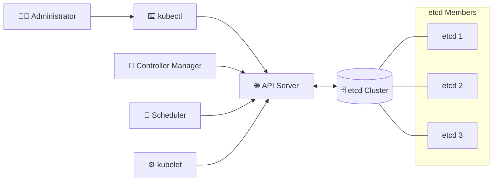

# etcd 🗄️

## 1. Overview

`etcd` is the distributed key-value database used by Kubernetes to store cluster state.

It contains information about resources such as:

* Pods
* Deployments
* Services
* ConfigMaps
* Secrets
* Nodes
* Roles and permissions
* Cluster configuration

Kubernetes components do not normally access `etcd` directly. They communicate through the **API server**, which reads from and writes to `etcd`.

---

## 2. How etcd Fits into Kubernetes



---

## 3. Main Concepts

| Concept         | Description                                 |
| --------------- | ------------------------------------------- |
| Key-value store | Stores Kubernetes state as keys and values  |
| Distributed     | Can run across multiple control-plane nodes |
| Quorum          | A majority of members must remain available |
| Leader          | Coordinates writes between members          |
| Consistency     | Members maintain an agreed cluster state    |
| Snapshot        | Backup of the current `etcd` database       |

A three-member `etcd` cluster can tolerate the failure of one member. A five-member cluster can tolerate two failures.

Odd-numbered clusters are preferred because adding an even-numbered member does not improve failure tolerance.

---

## 4. Syntax and Cheat Sheet

Check `etcd` Pods in a kubeadm-style cluster:

```bash
kubectl get pods -n kube-system | grep etcd
```

Inspect an `etcd` Pod:

```bash
kubectl describe pod <etcd-pod> -n kube-system
```

View logs:

```bash
kubectl logs <etcd-pod> -n kube-system
```

Check endpoint health with `etcdctl`:

```bash
etcdctl endpoint health
```

Display member information:

```bash
etcdctl member list
```

Check endpoint status:

```bash
etcdctl endpoint status --write-out=table
```

---

## 5. Practical Example

When a Deployment is created:

```bash
kubectl apply -f deployment.yaml
```

The API server validates the request and stores the Deployment definition in `etcd`.

Controllers then observe the desired state and create the necessary ReplicaSet and Pods. Their current status is also reported through the API server and stored in `etcd`.

If `etcd` becomes unavailable, existing containers may continue running temporarily, but the control plane cannot reliably process new changes.

---

## 6. Snapshot Example

Create a snapshot:

```bash
etcdctl snapshot save /backup/etcd-snapshot.db
```

Check the snapshot:

```bash
etcdctl snapshot status /backup/etcd-snapshot.db
```

Restore a snapshot:

```bash
etcdctl snapshot restore /backup/etcd-snapshot.db
```

A snapshot should be stored outside the cluster and tested regularly.

---

## 7. Common Problems 🚨

* Loss of quorum
* Expired TLS certificates
* Disk space exhaustion
* Slow disk performance
* Corrupted database
* Network failure between members
* Incorrect member configuration
* Missing or untested backups

---

## 8. Interview Questions 🎯

1. What does Kubernetes store in `etcd`?
2. Which component communicates directly with `etcd`?
3. What is quorum?
4. Why are odd-numbered member counts preferred?
5. How many failures can a three-member cluster tolerate?
6. What happens when `etcd` becomes unavailable?
7. Why are snapshots important?

---

## 9. Related Topics 🔗

* API Server
* Control Plane
* High Availability
* Quorum
* Backup and Restore
* Disaster Recovery
* TLS Certificates
* Kubernetes State
