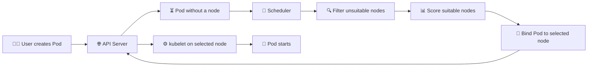

# Kubernetes Scheduler 📅

## 1. Overview

The **Kubernetes Scheduler** selects a suitable worker node for each newly created Pod.

It does not start containers itself. Instead, it watches for unscheduled Pods, evaluates available nodes, and assigns each Pod to the best matching node.

The kubelet on the selected node then starts the Pod.

---

## 2. Scheduling Flow



---

## 3. Main Responsibilities

| Responsibility      | Description                                       |
| ------------------- | ------------------------------------------------- |
| Watch pending Pods  | Finds Pods without an assigned node               |
| Filter nodes        | Removes nodes that cannot run the Pod             |
| Score nodes         | Ranks suitable nodes                              |
| Bind Pod            | Records the selected node                         |
| Respect constraints | Applies affinity, taints, resources, and policies |

The scheduler considers factors such as:

* Available CPU and memory
* Node labels
* Node affinity
* Pod affinity and anti-affinity
* Taints and tolerations
* Topology spread constraints
* Persistent volume requirements
* Scheduling policies

---

## 4. Syntax and Cheat Sheet


View pending Pods:

```bash
kubectl get pods --field-selector=status.phase=Pending
```


View scheduler Pod:

```bash
kubectl get pods -n kube-system | grep scheduler
```

View scheduler logs:

```bash
kubectl logs <scheduler-pod> -n kube-system
```

---

## 5. Practical Example

A Pod requests two CPU cores:

```yaml
resources:
  requests:
    cpu: "2"
```

The scheduler checks all worker nodes.

* Node 1 has only one free CPU core
* Node 2 has four free CPU cores
* Node 3 is tainted and the Pod has no toleration

The scheduler filters out Nodes 1 and 3, then assigns the Pod to Node 2.

---

## 6. YAML Example

```yaml
apiVersion: v1
kind: Pod
metadata:
  name: nginx-pod
spec:
  nodeSelector:
    disk: ssd
  containers:
    - name: nginx
      image: nginx:latest
      resources:
        requests:
          cpu: "250m"
          memory: "128Mi"
```

This Pod can only be scheduled on a node with the label:

```text
disk=ssd
```

---

## 7. Common Problems 🚨

* Insufficient CPU or memory
* Node selector matches no nodes
* Untolerated node taint
* Pod affinity rules cannot be satisfied
* Persistent volume cannot bind
* Nodes are marked unschedulable
* Scheduler is unavailable

---

## 8. Interview Questions 🎯

1. What does the Kubernetes Scheduler do?
2. Does the scheduler start containers?
3. What is the difference between filtering and scoring?
4. Why might a Pod remain in `Pending`?
5. How do taints affect scheduling?
6. What is the role of resource requests?
7. Which component starts the Pod after scheduling?

---

## 9. Related Topics 🔗

* Worker Nodes
* kubelet
* Resource Requests and Limits
* Node Selector
* Node Affinity
* Taints and Tolerations
* Pod Affinity
* Topology Spread Constraints
