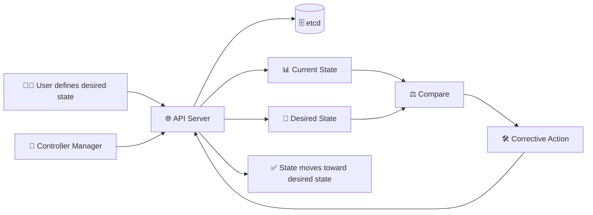

# Kubernetes Controller Manager 🔄

## 1. Overview

The **Kubernetes Controller Manager** runs controllers that continuously monitor the cluster and move it toward the desired state.

A controller compares:

* 🎯 Desired state
* 📊 Current state

When a difference is detected, the controller takes corrective action.

For example, if a Deployment requires three Pods but only two are running, a controller creates another Pod.

---

## 2. Reconciliation Flow



---

## 3. Main Controllers

| Controller                  | Purpose                                |
| --------------------------- | -------------------------------------- |
| Node Controller             | Monitors node health                   |
| Deployment Controller       | Manages Deployment rollouts            |
| ReplicaSet Controller       | Maintains the requested number of Pods |
| Job Controller              | Ensures Jobs complete                  |
| EndpointSlice Controller    | Maintains Service endpoints            |
| Namespace Controller        | Handles namespace deletion             |
| ServiceAccount Controller   | Creates default ServiceAccounts        |
| PersistentVolume Controller | Helps manage PV and PVC binding        |

The controller manager runs many controllers inside one control-plane process.

---

## 4. Syntax and Cheat Sheet

View controller-manager Pods:

```bash
kubectl get pods -n kube-system | grep controller-manager
```

View controller-manager logs:

```bash
kubectl logs <controller-manager-pod> -n kube-system
```

Inspect a Deployment:

```bash
kubectl describe deployment <deployment-name>
```

Inspect a ReplicaSet:

```bash
kubectl get replicasets
kubectl describe replicaset <replicaset-name>
```

View recent events:

```bash
kubectl get events --sort-by=.metadata.creationTimestamp
```

---

## 5. Practical Example

A Deployment requests three replicas:

```yaml
spec:
  replicas: 3
```

If one Pod crashes:

1. Kubernetes detects that only two replicas remain.
2. The ReplicaSet controller notices the difference.
3. A replacement Pod is created.
4. The scheduler selects a node.
5. The kubelet starts the new Pod.

This is a basic example of **self-healing**.

---

## 6. YAML Example

```yaml
apiVersion: apps/v1
kind: Deployment
metadata:
  name: web
spec:
  replicas: 3
  selector:
    matchLabels:
      app: web
  template:
    metadata:
      labels:
        app: web
    spec:
      containers:
        - name: nginx
          image: nginx:latest
```

The controller manager helps ensure that three matching Pods remain available.

---

## 7. Common Problems 🚨

* Controller manager is not running
* Desired replica count is not maintained
* Node failures are not detected
* Resource status is not updated
* API server communication fails
* RBAC or certificate problems block controller actions
* Misconfigured selectors prevent correct reconciliation

---

## 8. Interview Questions 🎯

1. What does the Controller Manager do?
2. What is reconciliation?
3. What is the difference between desired and current state?
4. Which controller maintains Pod replicas?
5. Does the Controller Manager schedule Pods?
6. How does Kubernetes replace a failed Pod?
7. Why are controllers important for self-healing?

---

## 9. Related Topics 🔗

* API Server
* etcd
* Scheduler
* Deployments
* ReplicaSets
* Jobs
* Nodes
* Reconciliation
