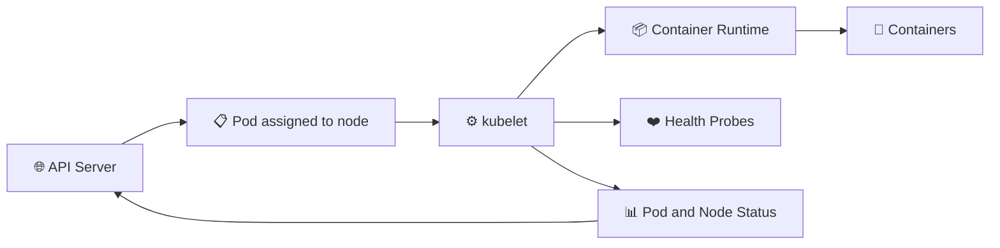

# kubelet ⚙️

## 1. Overview

The **kubelet** is the main Kubernetes agent running on each worker node.

It communicates with the API server, watches for Pods assigned to its node, and ensures that their containers are running correctly.

The kubelet does not choose where Pods run. The scheduler makes that decision.

---

## 2. kubelet Workflow



---

## 3. Main Responsibilities

| Responsibility      | Description                                      |
| ------------------- | ------------------------------------------------ |
| Watch assigned Pods | Monitors Pods scheduled to the node              |
| Start containers    | Requests container creation through the runtime  |
| Monitor workloads   | Checks container and Pod health                  |
| Run probes          | Executes liveness, readiness, and startup probes |
| Report status       | Sends node and Pod status to the API server      |
| Mount volumes       | Prepares storage required by Pods                |
| Manage static Pods  | Runs Pods defined in local manifest files        |

The kubelet manages Pods through the container runtime using the **Container Runtime Interface (CRI)**.

---

## 4. Syntax and Cheat Sheet

Check kubelet status:

```bash
systemctl status kubelet
```

Restart kubelet:

```bash
sudo systemctl restart kubelet
```

Enable kubelet at boot:

```bash
sudo systemctl enable kubelet
```

View kubelet logs:

```bash
journalctl -u kubelet
journalctl -u kubelet -f
```

Inspect the node:

```bash
kubectl get nodes
kubectl describe node <node-name>
```

View Pods assigned to a node:

```bash
kubectl get pods -A \
  --field-selector spec.nodeName=<node-name>
```

---

## 5. Practical Example

The scheduler assigns an NGINX Pod to `worker-1`.

The kubelet on `worker-1` then:

1. Reads the Pod specification.
2. Requests the container image.
3. Starts the container through the runtime.
4. Mounts required volumes.
5. Runs configured health probes.
6. Reports the Pod status to the API server.

If the container crashes, the kubelet may restart it according to the Pod restart policy.

---

## 6. YAML Example

```yaml
apiVersion: v1
kind: Pod
metadata:
  name: nginx-pod
spec:
  containers:
    - name: nginx
      image: nginx:latest
      livenessProbe:
        httpGet:
          path: /
          port: 80
        initialDelaySeconds: 10
        periodSeconds: 5
```

The kubelet runs the liveness probe and restarts the container when the probe repeatedly fails.

---

## 7. Common Problems 🚨

* kubelet service is stopped
* Node appears as `NotReady`
* API server cannot be reached
* Container runtime is unavailable
* TLS certificates are invalid or expired
* CNI plugin is not ready
* Disk or memory pressure affects the node
* Static Pod manifest contains errors

---

## 8. Interview Questions 🎯

1. What is the role of the kubelet?
2. Does the kubelet schedule Pods?
3. How does the kubelet start containers?
4. What information does the kubelet report?
5. Which component runs health probes?
6. What happens when the kubelet stops?
7. What is a static Pod?

---

## 9. Related Topics 🔗

* Worker Nodes
* Scheduler
* Container Runtime
* Pods
* Health Probes
* Static Pods
* Volumes
* Node Status
