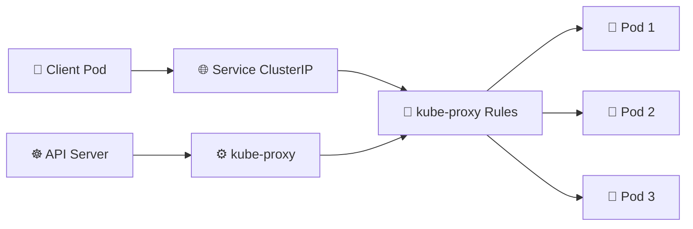

# kube-proxy 🌐

## 1. Overview

**kube-proxy** is a networking component that normally runs on every Kubernetes node.

It watches **Services** and **EndpointSlices** through the API server, then configures node-level networking rules so traffic sent to a Service can reach one of its backend Pods.

Despite its name, kube-proxy usually does not forward every packet through a traditional proxy process. It commonly programs Linux kernel networking rules instead.

---

## 2. Service Traffic Flow



---

## 3. Main Responsibilities

| Responsibility        | Description                                     |
| --------------------- | ----------------------------------------------- |
| Watch Services        | Detects Service creation, updates, and deletion |
| Watch EndpointSlices  | Learns which Pods back each Service             |
| Program network rules | Configures traffic redirection on each node     |
| Implement virtual IPs | Makes ClusterIP addresses usable                |
| Distribute traffic    | Sends connections to available endpoints        |
| Support NodePort      | Opens the Service’s allocated port on nodes     |

kube-proxy supports Services such as:

* `ClusterIP`
* `NodePort`
* `LoadBalancer`

`ExternalName` Services do not use the same virtual-IP mechanism.

---

## 4. Proxy Modes

| Mode       | Description                        |
| ---------- | ---------------------------------- |
| `iptables` | Uses Linux iptables rules          |
| `nftables` | Uses Linux nftables rules          |
| `ipvs`     | Uses Linux IP Virtual Server rules |

The mode used depends on the cluster version and configuration.

Some CNI implementations can replace kube-proxy entirely using technologies such as eBPF.

---

## 5. Syntax and Cheat Sheet

Find kube-proxy Pods:

```bash
kubectl get pods -n kube-system -l k8s-app=kube-proxy
```

View kube-proxy details:

```bash
kubectl describe pod <kube-proxy-pod> -n kube-system
```

View logs:

```bash
kubectl logs <kube-proxy-pod> -n kube-system
```

Inspect its DaemonSet:

```bash
kubectl get daemonset kube-proxy -n kube-system
kubectl describe daemonset kube-proxy -n kube-system
```

View configuration:

```bash
kubectl get configmap kube-proxy -n kube-system -o yaml
```

Inspect Services and endpoints:

```bash
kubectl get services
kubectl get endpointslices
```

---

## 6. Practical Example

A Service has the virtual IP `10.96.20.10` and selects three web Pods.

When a client connects to:

```text
10.96.20.10:80
```

node-level rules created by kube-proxy redirect the connection to one of the healthy backend Pod IP addresses.

The client uses the stable Service address and does not need to know which Pod receives the traffic.

---

## 7. YAML Example

```yaml
apiVersion: v1
kind: Service
metadata:
  name: web-service
spec:
  type: ClusterIP
  selector:
    app: web
  ports:
    - port: 80
      targetPort: 8080
```

kube-proxy helps direct connections from the Service port `80` to port `8080` on matching Pods.

---

## 8. Common Problems 🚨

* kube-proxy Pod is not running
* Service selector matches no Pods
* EndpointSlice contains no endpoints
* Incorrect `port` or `targetPort`
* Node firewall blocks NodePort traffic
* Network rules are missing or stale
* CNI and kube-proxy configuration conflict
* Replacement eBPF proxy is misconfigured

---

## 9. Interview Questions 🎯

1. What does kube-proxy do?
2. Why does a Service need kube-proxy or an equivalent implementation?
3. Does kube-proxy create Pod networking?
4. What information does kube-proxy watch?
5. What is the difference between `port` and `targetPort`?
6. How does kube-proxy support NodePort Services?
7. Can a Kubernetes cluster run without kube-proxy?

---

## 10. Related Topics 🔗

* Services
* ClusterIP
* NodePort
* LoadBalancer
* EndpointSlices
* CNI
* Pod Networking
* eBPF
