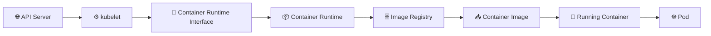

# Container Runtime 📦

## 1. Overview

A **container runtime** is the software responsible for downloading container images and running containers on a Kubernetes node.

The kubelet does not start containers directly. It communicates with the container runtime through the **Container Runtime Interface (CRI)**.

Common Kubernetes container runtimes include:

* `containerd`
* `CRI-O`

Docker Engine is not used directly by modern Kubernetes clusters because Kubernetes requires a CRI-compatible runtime.

---

## 2. Container Startup Flow



---

## 3. Main Responsibilities

| Responsibility         | Description                                |
| ---------------------- | ------------------------------------------ |
| Pull images            | Downloads images from registries           |
| Create containers      | Starts containers from images              |
| Stop containers        | Terminates containers when requested       |
| Manage container state | Tracks running and stopped containers      |
| Configure isolation    | Applies namespaces and cgroups             |
| Mount filesystems      | Prepares container filesystem layers       |
| Report status          | Sends container information to the kubelet |

The runtime handles containers, while Kubernetes manages higher-level resources such as Pods, Deployments, and Services.

---

## 4. Syntax and Cheat Sheet

Check containerd:

```bash
systemctl status containerd
```

Restart containerd:

```bash
sudo systemctl restart containerd
```

View containerd logs:

```bash
journalctl -u containerd
journalctl -u containerd -f
```

Use `crictl` to inspect CRI resources:

```bash
crictl info
crictl images
crictl ps
crictl ps -a
crictl pods
```

Inspect a container:

```bash
crictl inspect <container-id>
```

Pull an image:

```bash
crictl pull nginx:latest
```

---

## 5. Practical Example

The scheduler assigns an NGINX Pod to `worker-1`.

The kubelet on that node sends a request through CRI to the container runtime. The runtime then:

1. Checks whether the NGINX image exists locally.
2. Pulls the image if necessary.
3. Creates the Pod sandbox.
4. Starts the NGINX container.
5. Reports the container status to the kubelet.

---

## 6. YAML Example

```yaml
apiVersion: v1
kind: Pod
metadata:
  name: nginx-pod
spec:
  containers:
    - name: nginx
      image: nginx:1.27
      imagePullPolicy: IfNotPresent
```

The runtime checks for `nginx:1.27` locally and pulls it only when the image is missing.

---

## 7. Common Problems 🚨

* Container runtime service is stopped
* Image registry is unreachable
* Image name or tag is incorrect
* Registry authentication fails
* TLS certificate is not trusted
* Disk space is exhausted
* CRI socket is misconfigured
* Pod remains in `ContainerCreating`

---

## 8. Interview Questions 🎯

1. What is a container runtime?
2. How does the kubelet communicate with the runtime?
3. What is CRI?
4. What is the difference between `containerd` and Docker?
5. Who pulls container images in Kubernetes?
6. What does `imagePullPolicy` control?
7. What happens when the runtime stops?

---

## 9. Related Topics 🔗

* kubelet
* Pods
* Container Images
* CRI
* containerd
* CRI-O
* Image Registries
* Namespaces and cgroups
