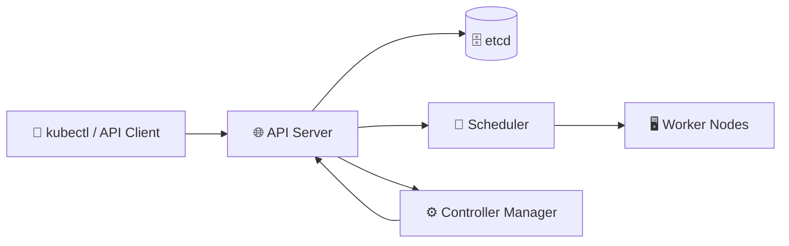

# Control Plane 🧠

## 1. Overview

The **Control Plane** manages the Kubernetes cluster.

It is responsible for:

* Receiving API requests
* Storing cluster state
* Scheduling Pods
* Running controllers
* Reconciling desired and actual state

In production environments, multiple control-plane nodes are commonly used for **high availability**.

---

## 2. Control Plane Architecture



The **API Server is the central communication point** for control-plane components.

---

## 3. Key Components

| Component                 | Purpose                            |
| ------------------------- | ---------------------------------- |
| `kube-apiserver`          | Exposes the Kubernetes API         |
| `etcd`                    | Stores cluster state               |
| `kube-scheduler`          | Selects nodes for unscheduled Pods |
| `kube-controller-manager` | Runs Kubernetes controllers        |

In some environments, additional control-plane components may also exist.

---

## 4. Cheat Sheet

Show cluster information:

```bash id="cpcmd1"
kubectl cluster-info
```

Check nodes:

```bash id="cpcmd2"
kubectl get nodes -o wide
```

View control-plane Pods:

```bash id="cpcmd3"
kubectl get pods -n kube-system
```

On kubeadm clusters:

```bash id="cpcmd4"
kubectl get pods -n kube-system \
  -l tier=control-plane
```

Inspect a control-plane node:

```bash id="cpcmd5"
kubectl describe node <control-plane-node>
```

---

## 5. Practical Example

Suppose a user creates a Deployment:

```bash id="cpex1"
kubectl create deployment web --image=nginx
```

The basic flow is:

```text id="cpflow2"
kubectl
   ↓
API Server
   ↓
etcd stores desired state
   ↓
Controller creates Pods
   ↓
Scheduler chooses nodes
   ↓
Worker kubelets start containers
```

The control plane **manages the workload**, while worker nodes actually run it.

---

## 6. YAML Example

Control-plane nodes are usually identified with labels such as:

```yaml id="cpyaml1"
metadata:
  labels:
    node-role.kubernetes.io/control-plane: ""
```

You can view them with:

```bash id="cpcmd6"
kubectl get nodes \
  -l node-role.kubernetes.io/control-plane
```

Control-plane nodes are often also tainted to prevent normal application workloads from being scheduled there.

---

## 7. Common Problems 🚨

* API Server is unavailable
* etcd loses quorum
* Scheduler is unhealthy
* Controller Manager stops reconciling resources
* Certificates expire
* Control-plane node loses connectivity
* All control-plane nodes are placed in one failure domain

---

## 8. Interview Questions 🎯

1. What is the Kubernetes Control Plane?
2. What does the API Server do?
3. What is stored in etcd?
4. What is the role of the scheduler?
5. What does the Controller Manager do?
6. Why are multiple control-plane nodes used?
7. Do application Pods normally run on control-plane nodes?
8. Why is etcd quorum important?

---

## 9. Related Topics 🔗

* API Server
* etcd
* Scheduler
* Controller Manager
* Worker Nodes
* High Availability
