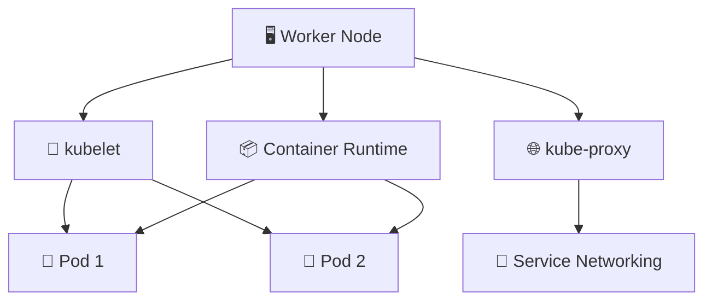

# Worker Nodes 🖥️

## 1. Overview

**Worker Nodes** are the machines that actually run application workloads.

The control plane decides **what should run and where**, while worker nodes provide the CPU, memory, networking, and container runtime needed to execute Pods.

A worker node typically runs:

* `kubelet`
* `kube-proxy`
* A container runtime
* Application Pods

---

## 2. Worker Node Architecture



The kubelet coordinates workload execution on the node.

---

## 3. Key Components

| Component         | Purpose                                  |
| ----------------- | ---------------------------------------- |
| `kubelet`         | Ensures assigned Pods are running        |
| `kube-proxy`      | Implements Service-related network rules |
| Container Runtime | Runs containers                          |
| Pods              | Application workloads                    |
| Node resources    | CPU, memory, storage, networking         |

Common runtimes include:

```text id="wnruntime1"
containerd
CRI-O
```

---

## 4. Cheat Sheet

List worker nodes:

```bash id="wncmd1"
kubectl get nodes
```

Show detailed information:

```bash id="wncmd2"
kubectl get nodes -o wide
```

Inspect a node:

```bash id="wncmd3"
kubectl describe node <node-name>
```

View workloads on a specific node:

```bash id="wncmd4"
kubectl get pods -A \
  --field-selector spec.nodeName=<node-name>
```

Check resource usage:

```bash id="wncmd5"
kubectl top node <node-name>
```

---

## 5. Practical Example

Suppose the scheduler chooses `worker-02` for a new Pod.

The basic flow becomes:

```text id="wnflow2"
Scheduler selects worker-02
          ↓
Pod assignment appears through API Server
          ↓
kubelet on worker-02 detects assignment
          ↓
Container runtime pulls the image
          ↓
Container starts
          ↓
Pod becomes Running
```

The worker node therefore executes the decision made by the control plane.

---

## 6. YAML Example

A Pod can request specific resources from a worker node:

```yaml id="wnyaml1"
apiVersion: v1
kind: Pod
metadata:
  name: web
spec:
  containers:
    - name: nginx
      image: nginx:1.27

      resources:
        requests:
          cpu: 250m
          memory: 256Mi
        limits:
          cpu: 500m
          memory: 512Mi
```

The scheduler only considers nodes capable of satisfying the Pod's resource requirements and other scheduling rules.

---

## 7. Common Problems 🚨

* Node becomes `NotReady`
* kubelet stops reporting status
* Container runtime fails
* Disk or memory pressure occurs
* Node runs out of allocatable resources
* Network connectivity fails
* Images cannot be pulled
* Pods cannot start on the node

---

## 8. Interview Questions 🎯

1. What is a Kubernetes worker node?
2. What does the kubelet do?
3. What is the role of the container runtime?
4. What does kube-proxy do?
5. How does a Pod reach a worker node?
6. What happens when a worker node becomes unavailable?
7. How do you list Pods running on a specific node?
8. What resources does a worker node provide?

---

## 9. Related Topics 🔗

* Control Plane
* kubelet
* kube-proxy
* Container Runtime
* Pods
* Scheduling
* Node Lifecycle
