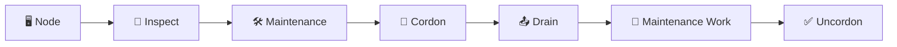

# Working with Nodes 🛠️

## 1. Overview

Day-to-day node administration usually involves:

* Inspecting node status
* Checking resource usage
* Viewing labels and taints
* Preparing nodes for maintenance
* Draining workloads
* Returning nodes to service

These operations are essential for cluster maintenance and troubleshooting.

---

## 2. Node Administration Flow



A typical maintenance workflow is:

```text id="nodeops2"
Inspect → Cordon → Drain → Maintain → Uncordon
```

---

## 3. Key Concepts

| Command    | Purpose                        |
| ---------- | ------------------------------ |
| `get`      | List nodes                     |
| `describe` | Show detailed node information |
| `top`      | Show CPU and memory usage      |
| `label`    | Add or remove node labels      |
| `taint`    | Control Pod eligibility        |
| `cordon`   | Stop new Pods from scheduling  |
| `drain`    | Evict workloads safely         |
| `uncordon` | Allow scheduling again         |

---

## 4. Cheat Sheet

List nodes:

```bash id="nodecmd1"
kubectl get nodes
kubectl get nodes -o wide
```

Inspect a node:

```bash id="nodecmd2"
kubectl describe node worker-01
```

Check resource usage:

```bash id="nodecmd3"
kubectl top nodes
kubectl top node worker-01
```

Show labels:

```bash id="nodecmd4"
kubectl get nodes --show-labels
```

Add a label:

```bash id="nodecmd5"
kubectl label node worker-01 disk=ssd
```

Add a taint:

```bash id="nodecmd6"
kubectl taint node worker-01 \
  dedicated=database:NoSchedule
```

---

## 5. Maintenance Workflow

Prevent new Pods from scheduling:

```bash id="nodecmd7"
kubectl cordon worker-01
```

Safely evict workloads:

```bash id="nodecmd8"
kubectl drain worker-01 \
  --ignore-daemonsets \
  --delete-emptydir-data
```

Perform maintenance.

Then return the node:

```bash id="nodecmd9"
kubectl uncordon worker-01
```

Check status:

```bash id="nodecmd10"
kubectl get nodes
```

---

## 6. YAML Example

Node labels can influence Pod placement:

```yaml id="nodeyaml1"
apiVersion: v1
kind: Pod
metadata:
  name: database
spec:
  nodeSelector:
    disk: ssd

  containers:
    - name: postgres
      image: postgres:17
      resources:
        requests:
          cpu: 500m
          memory: 512Mi
```

Label a suitable node:

```bash id="nodecmd11"
kubectl label node worker-01 disk=ssd
```

---

## 7. Common Problems 🚨

* Node is accidentally left cordoned
* `drain` is blocked by PodDisruptionBudget
* DaemonSet Pods prevent normal eviction behavior
* `emptyDir` data would be lost during drain
* Wrong node label causes scheduling issues
* Taint blocks workloads unexpectedly
* Metrics Server is unavailable, so `kubectl top` fails

---

## 8. Interview Questions 🎯

1. What does `kubectl cordon` do?
2. What does `kubectl drain` do?
3. What is the difference between cordon and drain?
4. What does `kubectl uncordon` do?
5. How do you check node resource usage?
6. How do you view node labels?
7. Why is `--ignore-daemonsets` commonly used with drain?
8. How would you safely take a worker node down for maintenance?

---

## 9. Related Topics 🔗

* Node Lifecycle
* Scheduling
* Taints and Tolerations
* Labels
* PodDisruptionBudget
* Resource Management
