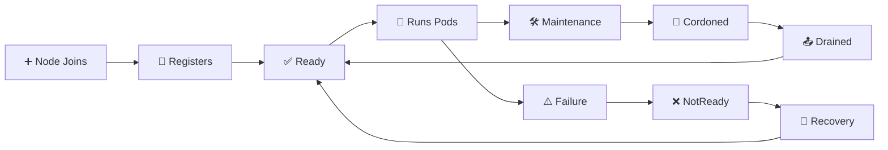

# Node Lifecycle 🔄

## 1. Overview

A Kubernetes node moves through several operational states during its lifetime.

Typical lifecycle events include:

* Joining the cluster
* Registering with the API Server
* Reporting health
* Becoming `Ready`
* Entering maintenance
* Becoming unreachable or `NotReady`
* Recovering
* Being removed from the cluster

Understanding node lifecycle is essential for troubleshooting and maintenance.

---

## 2. Lifecycle Flow



---

## 3. Key Concepts

| Concept           | Purpose                              |
| ----------------- | ------------------------------------ |
| Node registration | Adds the node to the cluster         |
| Heartbeat         | Reports node health                  |
| Lease             | Lightweight node heartbeat mechanism |
| `Ready`           | Node can accept workloads            |
| `NotReady`        | Node health is unhealthy or unknown  |
| Cordon            | Prevents new scheduling              |
| Drain             | Evicts workloads before maintenance  |
| Eviction          | Removes Pods from unhealthy nodes    |

---

## 4. Cheat Sheet

Check node state:

```bash id="nlcmd1"
kubectl get nodes
```

Inspect conditions:

```bash id="nlcmd2"
kubectl describe node <node-name>
```

Show node conditions directly:

```bash id="nlcmd3"
kubectl get node <node-name> \
  -o jsonpath='{.status.conditions}'
```

Check node Leases:

```bash id="nlcmd4"
kubectl get leases -n kube-node-lease
```

Prepare for maintenance:

```bash id="nlcmd5"
kubectl cordon <node-name>
kubectl drain <node-name> --ignore-daemonsets
```

Return it to service:

```bash id="nlcmd6"
kubectl uncordon <node-name>
```

---

## 5. Practical Example

Suppose `worker-02` loses connectivity.

The lifecycle may look like:

```text id="nlex1"
worker-02
   ↓
Heartbeats stop
   ↓
Node becomes NotReady / Unknown
   ↓
Kubernetes detects unhealthy node
   ↓
Affected Pods may eventually be replaced
   ↓
Node recovers or is removed
```

Controllers and the scheduler work together to restore the desired application state.

---

## 6. YAML Example

Node status is managed by Kubernetes, but workload behavior can be influenced with tolerations:

```yaml id="nlyaml1"
apiVersion: v1
kind: Pod
metadata:
  name: resilient-app
spec:
  tolerations:
    - key: node.kubernetes.io/not-ready
      operator: Exists
      effect: NoExecute
      tolerationSeconds: 60

  containers:
    - name: app
      image: nginx:1.27
```

This Pod tolerates a `NotReady` node for 60 seconds before becoming eligible for eviction.

---

## 7. Common Problems 🚨

* kubelet stops reporting heartbeats
* Node remains `NotReady`
* Network failure isolates the node
* Node stays cordoned after maintenance
* Pods cannot be evicted because of PDB restrictions
* Node has DiskPressure or MemoryPressure
* Stale node objects remain after machines are removed

---

## 8. Interview Questions 🎯

1. What does `Ready` mean for a node?
2. What causes a node to become `NotReady`?
3. How does Kubernetes monitor node health?
4. What are Node Leases?
5. What happens to Pods on a failed node?
6. What is the purpose of cordon and drain?
7. What does `NoExecute` do?
8. How do you safely remove a node from service?

---

## 9. Related Topics 🔗

* Working with Nodes
* kubelet
* Scheduling
* Taints and Tolerations
* PodDisruptionBudget
* Node Pressure
* Eviction
