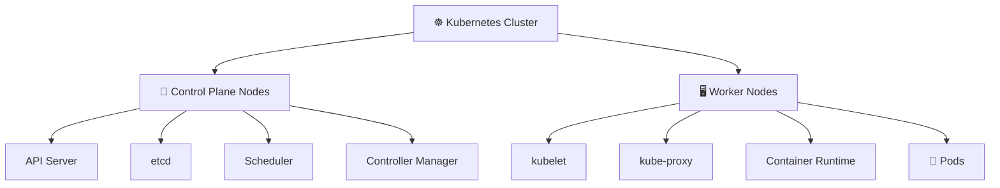

# Kubernetes Nodes 🖥️

## Overview

A **Node** is a machine that participates in a Kubernetes cluster.

Nodes generally fall into two categories:

* **Control Plane Nodes** — manage the cluster
* **Worker Nodes** — run application workloads

Together, they form the basic execution architecture of Kubernetes.

---

## Cluster Architecture



The control plane makes decisions and maintains cluster state.

Worker nodes execute workloads.

---

## Folder Structure

```text
Nodes/
├── README.md
├── Control-Plane.md
├── Worker-Nodes.md
├── Working-with-Nodes.md
└── Node-Lifecycle.md
```

---

## Main Topics

### `Control-Plane.md`

Explains the components responsible for managing the Kubernetes cluster:

* API Server
* etcd
* Scheduler
* Controller Manager
* High Availability basics

### `Worker-Nodes.md`

Covers the components responsible for running workloads:

* kubelet
* kube-proxy
* Container Runtime
* Pods
* Node resources

### `Working-with-Nodes.md`

Focuses on day-to-day node administration:

```bash
kubectl get nodes
kubectl describe node
kubectl top nodes
kubectl cordon
kubectl drain
kubectl uncordon
```

It also covers labels, taints, and resource inspection.

### `Node-Lifecycle.md`

Explains how nodes:

* Join the cluster
* Report health
* Become `Ready` or `NotReady`
* Enter maintenance
* Recover from failures
* Leave the cluster

---

## Useful Commands

```bash
kubectl get nodes
kubectl get nodes -o wide
kubectl describe node <node-name>

kubectl top nodes

kubectl get nodes --show-labels

kubectl cordon <node-name>
kubectl drain <node-name> --ignore-daemonsets
kubectl uncordon <node-name>
```

---

## Quick YAML Example

Nodes can carry labels used by the scheduler.

A Pod can request a labeled node:

```yaml
apiVersion: v1
kind: Pod
metadata:
  name: web
spec:
  nodeSelector:
    disk: ssd

  containers:
    - name: nginx
      image: nginx:1.27
```

The Pod can only run on a node labeled:

```text
disk=ssd
```

---

## Goal

The goal of this folder is to explain **what Kubernetes nodes are, how control-plane and worker nodes differ, how administrators work with nodes, and how nodes behave throughout their lifecycle**.

After completing it, the reader should understand the basic machine-level architecture of a Kubernetes cluster.
