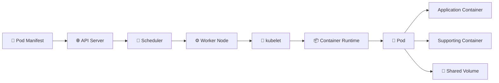

# Pods 🚀

## 1. Overview

A **Pod** is the smallest deployable unit in Kubernetes. It contains one or more closely related containers that run together on the same worker node.

Containers inside a Pod share:

* 🌐 One Pod IP address
* 🔌 The same network namespace
* 💾 Attached volumes
* ⏱️ A shared lifecycle
* ⚙️ The same scheduling destination

Most Pods contain one application container. Multi-container Pods are used when containers must cooperate closely.

Pods are temporary. When a Pod is deleted or fails permanently, Kubernetes creates a new Pod rather than repairing the original one. Production Pods are therefore normally managed by controllers such as Deployments, StatefulSets, DaemonSets, and Jobs.

## 2. Pod Workflow



## 3. Pod Anatomy

| Field             | Purpose                                     |
| ----------------- | ------------------------------------------- |
| `metadata`        | Defines the Pod name, namespace, and labels |
| `spec.containers` | Lists containers running inside the Pod     |
| `image`           | Specifies the container image               |
| `ports`           | Documents container listening ports         |
| `env`             | Defines environment variables               |
| `volumes`         | Defines storage available to the Pod        |
| `restartPolicy`   | Controls container restart behaviour        |

## 4. Cheat Sheet

```bash
kubectl get pods
kubectl get pods -A
kubectl get pods -o wide
kubectl describe pod <pod-name>
kubectl logs <pod-name>
kubectl exec -it <pod-name> -- /bin/sh
kubectl get pod <pod-name> -o yaml
kubectl delete pod <pod-name>
```

Create a temporary Pod:

```bash
kubectl run nginx --image=nginx
```

## 5. Practical Example

An administrator creates an NGINX Pod. Kubernetes stores the definition, selects a worker node, and instructs the kubelet to start the container.

The Pod receives its own cluster IP address. Other workloads can communicate with it directly, but a **Service** is normally required to provide stable access because a replacement Pod may receive a different IP address.

## 6. YAML Example

```yaml
apiVersion: v1
kind: Pod
metadata:
  name: nginx-pod
  labels:
    app: nginx
spec:
  containers:
    - name: nginx
      image: nginx:1.27
      ports:
        - containerPort: 80
```

Apply the manifest:

```bash
kubectl apply -f pod.yaml
```

## 7. Common Problems 🚨

* Pod remains in `Pending`
* Image cannot be pulled
* Container repeatedly crashes
* Incorrect command or environment variable
* Health probe fails
* Volume cannot be mounted
* Pod is created in the wrong namespace

## 8. Interview Questions 🎯

1. What is a Pod?
2. Can containers inside a Pod communicate through `localhost`?
3. Why are Pods considered temporary?
4. Does every container receive a separate Pod IP?
5. Why are Pods usually managed by controllers?
6. What happens when a Pod is deleted?

## 9. Related Topics 🔗

* Containers
* Deployments
* Multi-Container Pods
* Init Containers
* Services
* kubelet
* Health Probes
