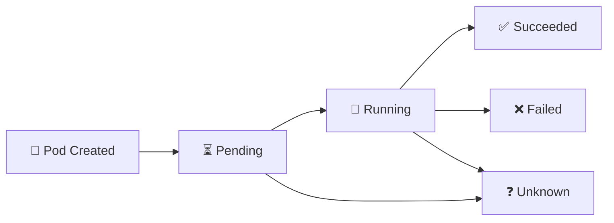

# Pod Lifecycle 🔄

## 1. Overview

A Pod moves through several phases from creation to termination. Understanding these phases helps administrators quickly determine whether a Pod is starting normally, running correctly, or failing.

The main Pod phases are:

* `Pending`
* `Running`
* `Succeeded`
* `Failed`
* `Unknown`

A Pod phase gives a high-level summary, while container states and events provide more detailed troubleshooting information.

---

## 2. Pod Lifecycle Flow



---

## 3. Main Pod Phases

| Phase       | Meaning                                                         |
| ----------- | --------------------------------------------------------------- |
| `Pending`   | Pod accepted, but containers are not fully running yet          |
| `Running`   | Pod is assigned to a node and at least one container is running |
| `Succeeded` | All containers completed successfully                           |
| `Failed`    | Containers terminated and at least one failed                   |
| `Unknown`   | Kubernetes cannot determine the Pod state                       |

Container states are more specific:

* `Waiting`
* `Running`
* `Terminated`

---

## 4. Cheat Sheet

View Pod phases:

```bash
kubectl get pods
```

View detailed state:

```bash
kubectl describe pod <pod-name>
```

View container status:

```bash
kubectl get pod <pod-name> -o yaml
```

Check restart count:

```bash
kubectl get pods
```

View events:

```bash
kubectl get events --sort-by=.metadata.creationTimestamp
```

View previous container logs:

```bash
kubectl logs <pod-name> --previous
```

---

## 5. Practical Example

A newly created Pod may remain in `Pending` while Kubernetes:

1. Selects a worker node
2. Pulls the container image
3. Mounts storage
4. Configures networking
5. Starts the container

If the application starts successfully, the Pod enters `Running`.

If the container later exits unexpectedly, the kubelet may restart it depending on the restart policy. The Pod can therefore remain in `Running` even while one container is repeatedly crashing.

---

## 6. YAML Example

```yaml
apiVersion: v1
kind: Pod
metadata:
  name: lifecycle-demo
spec:
  restartPolicy: OnFailure
  containers:
    - name: task
      image: busybox
      command:
        - sh
        - -c
        - echo "Running task"; sleep 5; exit 0
```

This Pod eventually reaches `Succeeded` because the container completes successfully.

---

## 7. Common Problems 🚨

* Pod remains in `Pending`
* Container stays in `Waiting`
* Repeated `CrashLoopBackOff`
* Image pull failures
* Pod becomes `Unknown`
* Container exits unexpectedly
* High restart count

---

## 8. Interview Questions 🎯

1. What are the main Pod phases?
2. What does `Pending` mean?
3. Can a Pod be `Running` while a container is restarting?
4. What is the difference between Pod phase and container state?
5. When does a Pod reach `Succeeded`?
6. What does `Unknown` usually indicate?
7. How do you inspect previous container logs?

---

## 9. Related Topics 🔗

* Pods
* Restart Policy
* Health Probes
* kubelet
* CrashLoopBackOff
* Container States
* Pod Troubleshooting
