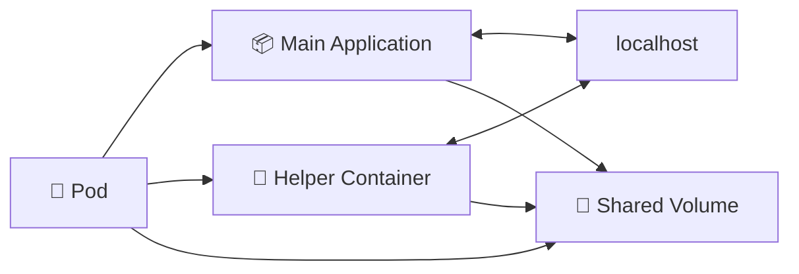

# Multi-Container Pods 📦

## 1. Overview

A **multi-container Pod** contains two or more containers that must run closely together on the same worker node.

Containers inside the same Pod share:

* 🌐 The same Pod IP
* 🔌 The same network namespace
* 💾 Shared volumes
* ⚙️ The same scheduling destination
* ⏱️ The same Pod lifecycle

They can communicate through `localhost`, which makes multi-container Pods useful when one container supports another.

Typical patterns include logging helpers, proxies, file processors, and monitoring agents.

---

## 2. How They Work



The containers are separate processes, but Kubernetes schedules and manages them as one Pod.

---

## 3. Cheat Sheet

View Pods:

```bash
kubectl get pods
```

List containers inside a Pod:

```bash
kubectl get pod <pod-name> \
  -o jsonpath='{.spec.containers[*].name}'
```

View logs from a specific container:

```bash
kubectl logs <pod-name> -c <container-name>
```

Open a shell inside a specific container:

```bash
kubectl exec -it <pod-name> \
  -c <container-name> -- /bin/sh
```

Describe the Pod:

```bash
kubectl describe pod <pod-name>
```

---

## 4. Practical Example

Suppose an application writes logs to:

```text
/var/log/app.log
```

A second container can read that file from a shared volume and process or forward the logs.

The application container focuses only on the application, while the helper container handles log processing.

This is useful when the two processes must stay tightly coupled.

---

## 5. YAML Example

```yaml
apiVersion: v1
kind: Pod
metadata:
  name: multi-container-pod
spec:
  volumes:
    - name: shared-logs
      emptyDir: {}

  containers:
    - name: web
      image: nginx:1.27
      volumeMounts:
        - name: shared-logs
          mountPath: /var/log/nginx

    - name: log-reader
      image: busybox
      command:
        - sh
        - -c
        - tail -f /logs/access.log
      volumeMounts:
        - name: shared-logs
          mountPath: /logs
```

Both containers access the same `emptyDir` volume.

---

## 6. Common Problems 🚨

* Wrong container selected when using `logs` or `exec`
* Shared volume mounted at incorrect paths
* One container consumes excessive resources
* Supporting container crashes repeatedly
* Containers are unrelated and should be separate Pods
* Port conflicts occur inside the shared network namespace

---

## 7. Interview Questions 🎯

1. What is a multi-container Pod?
2. How do containers inside the same Pod communicate?
3. Do containers inside a Pod have separate IP addresses?
4. Can containers share storage?
5. Why would you use multiple containers in one Pod?
6. When should containers be placed in separate Pods?
7. How do you view logs from one specific container?

---

## 8. Related Topics 🔗

* Pods
* Init Containers
* Sidecar Containers
* Shared Volumes
* `emptyDir`
* Container Networking
